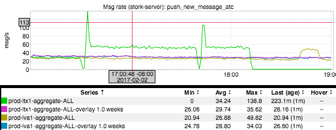

+++
title = "A Tale of Terror"
date = "2017-02-09"
slug = "a-tale-of-terror"
draft = false
+++

[I'd like to talk about a recent GCN that is one of the scariest I've seen at LinkedIn. The actual impact was limited; it only hit services that were deployed ](https://jira01.corp.linkedin.com:8443/browse/GCN-22695) during the incident, and it happened relatively late in the day so only a handful of things had been deployed in that timeframe. ...but had it happened earlier in the day...oh, man, could it ever have been worse. I only have a single inGraph to share from this one:

This is what push notification sends for Messaging (sent through ATC) looked like during the incident. A super-quick primer on how ATC works: ATC is responsible for managing a subset of outbound communications from LinkedIn. Outbound messages routed through ATC are mirrored to all production fabrics, and ATC uses lix to determine the fabric from which to send push/emails. If the message happens to be in the lix bucket from which ATC is supposed to send in that fabric, it sends. If not, ATC drops the message.

***..but what if lix goes away?***

Giant, bold, underlined, italic font because that's the entire point of this post. (I actually just spent 5 minutes trying to figure out how to make the font bigger.) In the case of ATC it Fails Open, which is to say: in the absence of information about what it *should* send, it simply sends everything. This means sending duplicates in a failure scenario like this one. Imagine getting duplicate pushes for every message you receive from LinkedIn Messaging. Awful.

Maybe you don't use LinkedIn Messaging a whole lot. That's fine...and it's not the point. Allow me to repeat:

***What happens if lix goes away?***

Fuck A/B testing of copy changes or relevance modeling or any of that; XLNT results are not what I'm talking about. An (hilarious) email went out talking about "these 6 or so lixen were the only ones impacted, so otherwise we're good!" Cool...but what happens to *your* product if lix returns *control* for all members?

Maybe you're leveraging lix for data migration. Maybe you're using it to wrap a potentially dangerous infrastructure change. In short: Maybe your use case has nothing to do with A/B testing. As a company we've embraced lix as a mechanism for being able to carefully ramp anything and everything to a targeted population for vetting/verification. One of the very first questions asked when a code change might have impact is "can we lix this?" The intent is that we can ramp the change gradually, and then turn it off and go back to the drawing board if it went awry.

***What happens if lix goes away?***

Repeating it a third time. How will your product behave? Will your product even work at all?

Seriously. I don't mean to give you nightmares, but *think about it.*

