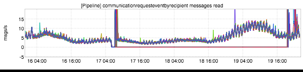
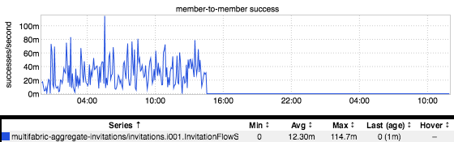

+++
title = "Patterns (The Flatline)"
date = "2017-02-16"
slug = "patterns-the-flatline"
draft = false
+++

I almost feel like this is a duplicate post in that it's super-similar to _The Dreaded Plateau, only in reverse. Similar to that pattern, it's not generally something _ you want to see. Like when kafka production to a particular set of partitions ceases for some reason, and your consumers have nothing to consume:

...or one node in your jankitudinous wreck of a legacy service decides it's toly **way** more important to GC itself into oblivion than it is to serve requests:

"But Cliff", you say, "You're always so negative. Show me some shining example of a time when this pattern might actually be **awesome**!" Well, gentle reader, I can do that. Take a look at this beauty:

This inGraph is of a legacy service that is finally being ramped down for good. It's taking it's last dying breaths - a slow trickle of queries - and then that final ramp happens, and it's gone for good. Beep...beep...beep...beeeeeeeeeeee. One more piece of tech debt gone.
