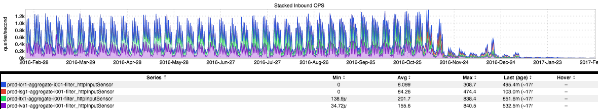

+++
title = "Decom Lessons Learned"
date = "2017-02-23"
slug = "decom-lessons-learned"
draft = false
+++

_This week's post is really more of a re-blog of Ting Sun's Eng Blog post about _[Lessons Learned from Decommissioning a Legacy Service](https://engineering.linkedin.com/blog/2017/02/lessons-learned-from-decommissioning-a-legacy-service). I know, I should be posting my own shit...but this is an opportunity to highlight an excellent & positive follow-on to a [previous igotw](/igotw/2016-11-17-the-long-tail-of-sadness/). If you happened to read that then this should look familiar to you:

_Well done, Ting Sun_!
