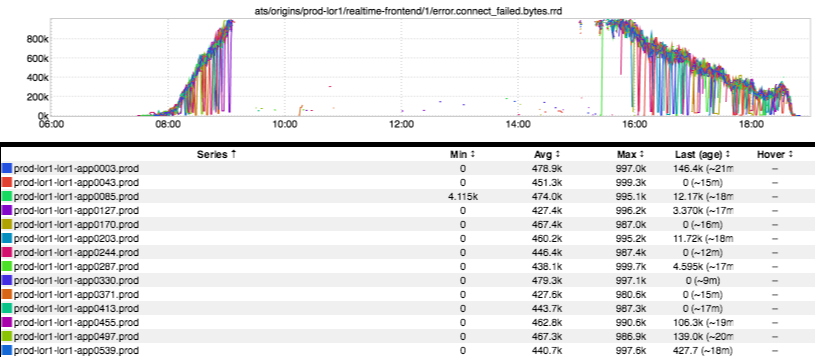
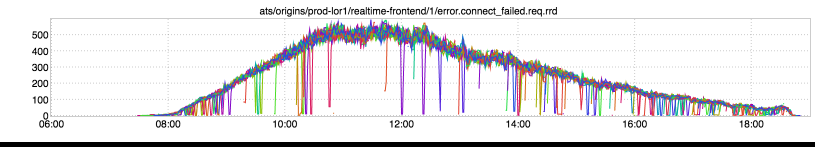
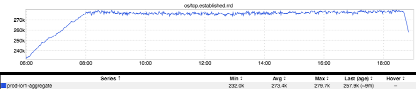

+++
title = "Escalator to (and from!) Nowhere"
date = "2017-03-02"
slug = "escalator-to-and-from-nowhere"
draft = false
+++

In a previous [Unintentional Art post](/igotw/2016-04-21-unintentional-art/)[ I referenced a great moment from an episode of The Simpsons (without attribution - shame on me!) Well, this week I've ](https://www.youtube.com/watch?v=7I95rdKhWD0) got an escalator that not only goes nowhere, but also returns! Feast your eyes on this one:

This is an inGraph of what [GCN-22862 looked like. It shows l1proxy failing to connect to realtime-frontend, in terms of failed bytes'-worth of requests. A ](https://jira01.corp.linkedin.com:8443/browse/GCN-22862) graph from the same timeframe that looks less like an escalator to nowhere but is nonetheless still interesting:

This is the number of actual failing requests. *[Side Note: The bytes graph looks like it does due to a maximum value set at 1M. That's why it just kinda* *"disappears" once it goes beyond 1 million. [Side Side Note: I haven't the faintest idea why there is a maximum, nor why 1M was selected as the* *maximum...]]*

This one was tricky to troubleshoot. If your service never even receives the requests (and your hosts don't, either!) then there's not a whole lot to go on. One piece of forensic evidence we **did** have:

Ah, now there's a lovely _plateau, and it aligns with both of the above two inGraphs. Established connections established remain pegged out at some _ value...but *why*_? Well, after some investigation (and a bit of help from Tom Wiedenbein_ from traffic-sre) we discovered that l1proxy has a per-origin connection limit. This limit was set to 8,000 for realtime-frontend. Multiply that by the number of l1proxy hosts in lor1 (34) and you get 272,000...more or less exactly where the number of established connections _flatlines._

