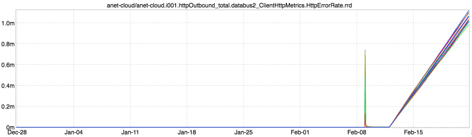
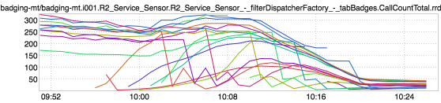

+++
title = "Unintentional Art"
date = "2017-03-09"
slug = "unintentional-art"
draft = false
+++

_Just a few interesting bits of unintentional art this week. First up, a piece dubbed "Rainbows (But No Unicorns)" by Kyle Goedtel:_

Along fairly similar visual lines, a refractive piece that fans of Floyd might find familiar:

...and, for something a little different, a little more organic, there's this lil guy:

I thought it looked kinda like an armadillo, then maybe an anteater...but my wife ultimately convinced me it looks most like a shrew.

Happy Thursday, folks.
