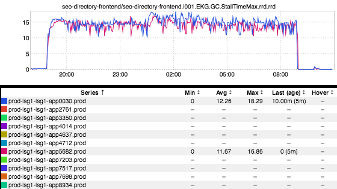
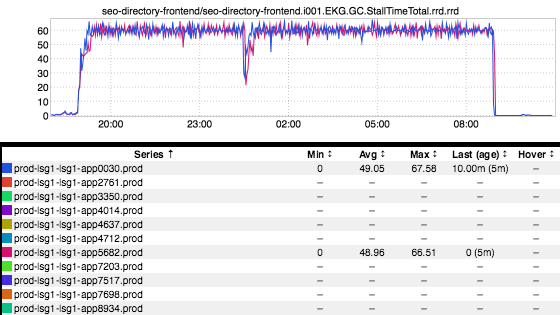

+++
title = "Stall Time"
date = "2017-03-23"
slug = "stall-time"
draft = false
+++

_In a Java World garbage collection (GC) is a fact of life. I've posted graphs similar to the below on at least two previous __occasions__ __ but I've never given a _ whole lot of detail about what they actually mean. I feel like these particular metrics are relevant enough to warrant their own post, so without further ado:

Here are a couple of stall time inGraphs. You can get to them fairly quickly using filters. For example, I commonly use something like:

[http://ingraphs.prod.linkedin.com/container/seo-directory-frontend/?filter=garbage%7Cstall&fabric_groups=prod](http://ingraphs.prod.linkedin.com/container/seo-directory-frontend/?filter=garbage%7Cstall&fabric_groups=prod)

Simply replace *seo-directory-frontend* with the name of your service and you'll get both stall time and GC inGraphs. GC inGraphs are a subject for a future post; for now, we're going to focus in on stall time metrics. If everything is working well you should get the two graphs pictured above, and for your sake they hopefully don't look like this. It's also possible that the graphs won't show up or will have no data - there is an inherent flakiness to these metrics (I'll talk about that a bit below) - but if they **are** available they are super valuable.

Let's talk a bit about what these graphs actually represent. The first one - StallTimeMax - represents the single longest "stop-the-world" GC pause (given in seconds) that was seen in a one-minute period. The second inGraph - StallTimeTotal - shows the total amount of time spent in stop-the-world GC within a one-minute period. Sometimes either of these will jump above 60 but this is just jitter introduced by time-boxing; the total time spent in a single GC may be longer than 60 seconds, but it makes sense for 60 seconds to be the maximum value that you can spend in garbage collection since there are only 60 seconds in a minute.

Here are two things I really like about these metrics:

1. These metrics are significantly more straightforward to interpret than the other GC/heap metrics that we emit. GC/heap metrics can be valuable, but they can require some calculation. "Okay, so I did *N* GCs and on average they took *M* seconds, so that means..." You shouldn't need a calculator to figure out what the fuck is going on in an inGraph. It kind of defeats the purpose.

2. These metrics are emitted out-of-band. A script running on each host discovers the services running, parses the GC log for that service, and pumps out metrics. This can be super-helpful in the case that your service is so hosed that it's not properly firing GC sensors but   continuing to **is** write to its gc.log.

As you may have guessed, there is something I **don't** like about these metrics...and that is their flakiness. Sometimes the script isn't installed at all. The script is relatively fragile and sometimes fails to parse logs and dies.  For example, if the GC signature changes - e.g., you decided to swap out CMS for G1 - it tends to just shit itself and give up until restarted. How do you restart it? Well, overall operability of the script is pretty opaque. I'm sure there's a wiki page somewhere (lol!) but if I took a survey of 1000 engineers about how this metric gets generated and how to restart it when it breaks I'd expect fewer than 20 to know the answer to both questions (or either of them, honestly). When it Just Works it's wonderful, but when it doesn't it...well...Just Doesn't.

