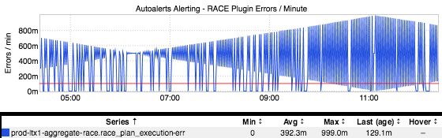
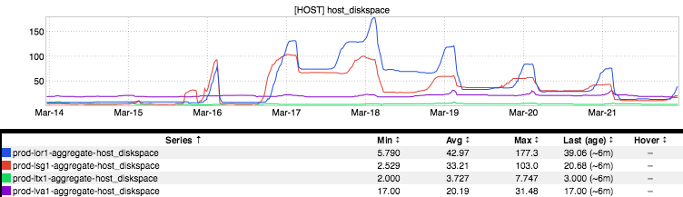
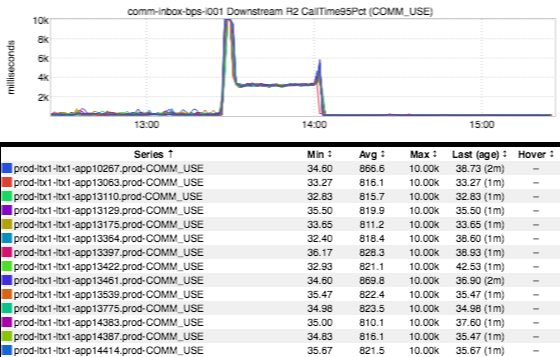
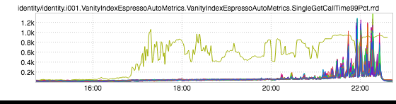

+++
title = "Unintentional Art"
date = "2017-03-30"
slug = "unintentional-art"
draft = false
+++

_I've got UA starting to overrun my stockpile of inGraphs snapshots, so it's time to get a few of 'em out there. First up: some diamonds, courtesy of Richard _ _Waid and a bit similar to some UA from _[a prior post:](/igotw/2016-04-21-unintentional-art/)

Next, one from _Matt Knecht_ that both has an interesting backstory **and** makes me think of a chainsaw:

One of the most rock-n-roll inGraphs I think I've ever seen:

...and last, but certainly not least:

I've stared at this inGraph - I mean, really thought about it - an awful lot. i've come up with multiple interpretations, all of which have precisely fuckall to do

with what actually happened...and none of which I will post here. Spend some time with it. Let me know what **you** think about it next time we meet.
