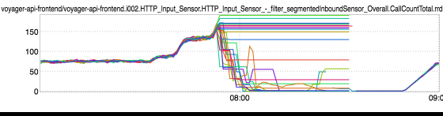
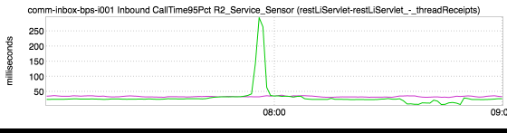
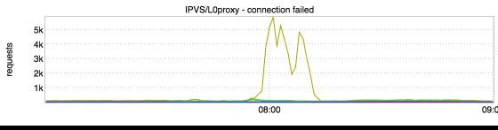
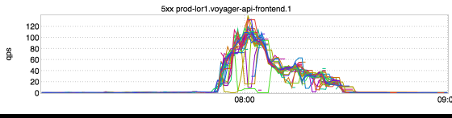
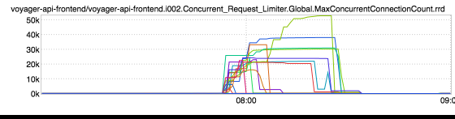
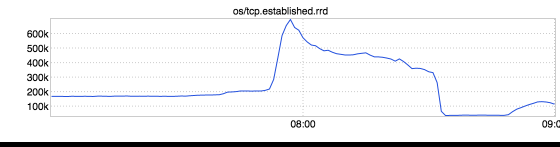
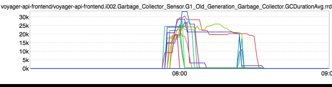
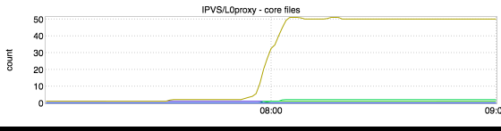
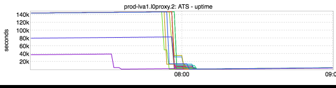

+++
title = "Cascading Failure"
date = "2017-04-06"
slug = "cascading-failure"
draft = false
+++

There have been a handful of failures of the voyager-api-frontend messaging cluster this past week. Three of these failures have had the same/similar characteristics, and we now think we have a fairly good understanding of what was actually happening. I'll outline the events below below. Keep in mind that while I'm putting these in numeric order, all of these things happened so quickly, so close together that they were for all intents and purposes "immediate".

1) Things begin with a planned traffic shift load test which drives more traffic to the v-api.messaging cluster in prod-lor1. The total amount of inbound traffic and fanout is more than this cluster has ever seen before due to one or more product ramps.

2) When v-api.messaging is "running hot" there is an "event" that causes it to tip over. Current working theory is that this event is that a high-qps downstream endpoint (threadReceipts) exhibited a significant increase in latency:

3) This causes connections to start failing/backing up at the traffic tier:

4) Not only does the traffic tier start returning 500s, it actually starts retrying requests to a frontend that is already under duress. Like, a lot. (Due to a bug, it retries something on the order of ~36 times per original request.) v-api.messaging gladly accepts the piling up incoming requests despite not having the ability to actually service them all. Number of concurrent connections quickly shoots up from ~200 per node into the tens of thousands:

5) v-api.messaging blows through its heap and goes into a death spiral:

6) Due to a bug, some combination of the large number of outstanding (and unresponsive) open retried connections causes l0proxy to start dumping core and dying:

Gnarly. In addition to looking into the overall traffic increase and capacity uplifts in a couple of places, there are a handful of things we're doing to protect against this in the future; namely:

Patching both the retry and state table core dump bugs (l0 shouldn't have behaved as it did in this case) Configuring a limit on global max concurrent connections for v-api.messaging (refusing connections is preferable to falling over completely and dragging down the fabric in the process)

Looking into tuning timeouts to this particular downstream service (timing out may be better than falling over completely)

...in addition to whatever AIs come out of the postmortem next week.
