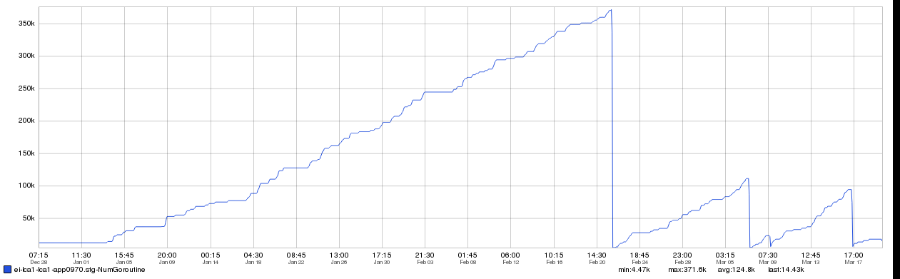
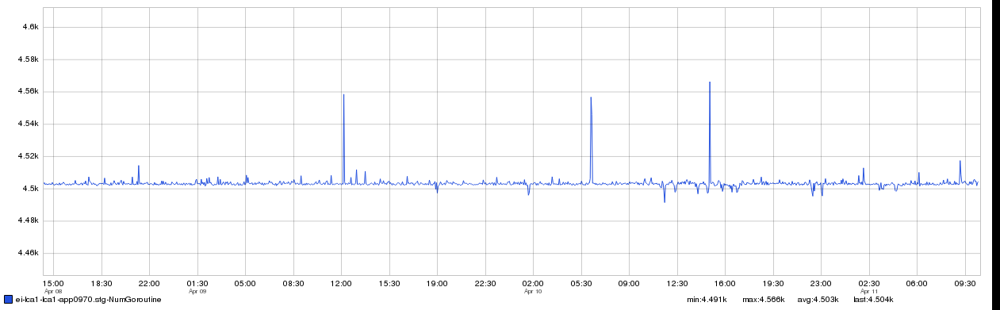

+++
title = "Go-Routine Leak"
date = "2017-04-13"
slug = "go-routine-leak"
draft = false
+++

*[This week's igotw is a guest post by* *Ahmed Sharif* *original wiki page* *(**). Thanks for sharing, Ahmed!]*

In _obhc-server we monitor the number of currently running go-routines among other things. For the last several _months we observed the pattern below for the number of go-routines ([inGraphs snapshot link](http://ingraphs.prod.linkedin.com/snapshot/obhc-server%20number%20of%20ro-routine_20170320_182741/)).

The number of go-routines was always going up and up until the application is restarted because of deployment. Clearly there was a go-routine leak.

The task of obhc-server is really simple, all it does is receives health check (port check, disk space check, etc.) status [from obhc-agent](https://gitli.corp.linkedin.com/obhc/obhc-agent/source/5d3e1f3637e19a7871338529ca21706d51b9b75d:) and stores them in [couchbase to be used later. To get a better picture of what the server process is doing, we added the following lines](https://gitli.corp.linkedin.com/obhc/obhc-server/commit/73bb6831cc0fb8a2e8cfc2076521c579fd4b6961) that enables a profiler and exposes various runtime attributes via an http endpoint.

**Golang Profiler**

--- a/src/obhc-server/main.go +++ b/src/obhc-server/main.go @@ -20,6 +20,8 @@ "obhc-server/metrics" "obhc-server/state" ) +import _ "net/http/pprof" +import _ "net/http" @@ -135,6 +137,9 @@ +   go func() { +   log.Println(http.ListenAndServe("0.0.0.0:6060", nil)) +   }()

We observed the heap dump of various go-routines after running the server against couple of obhc-agent and noticed that the number of instances of a part icular go-routine named '***handleHeartbeatExpiration***' was going up. This go-routine is used to track the heartbeat of an obhc-agent. It has a timer that gets reset every time we hear from the agent. The total number of instances of this routine should be equal to the number of agent known to the server, [which is about 6k in a prod fabric since we've about 18k servers[1] in a prod fabric[2] and there are 3 obhc-servers in each fabric. Each of them handles ](2017-04-13 - ingraph-of-the-week-go-routine-leak.html#2) approximately an equal number of agents. However the total number of reported go-routine was much higher than this and continuously growing.

After some more testing we realized every time an obhc-agent stops we stop the timer, but when it starts again instead of using the same go-routine we start another go-routine while the previous go-routine is still running. The restart of an agent happens all the time because it is part of ECL and every time a new version of ECL is deployed, obhc-agent is restarted by CFEngine.

The fix was surprisingly simple. In fact just a couple [lines](https://gitli.corp.linkedin.com/obhc/obhc-server/commit/d3c7cc3ca808edff374f6b8620c6a3532fe55634) of change to be exact. Apparently we were removing the go-routine instance from our internal ma p (dictionary) which it was still running.

[This is what the graph looks like after the fix. (ingraph snapshot link). There are a few spikes (this is expected), but the number is capped at around 4.5k ](http://ingraphs.prod.linkedin.com/snapshot/obhc-server%20number-of-go-routine%20after%20the%20fix_20170411_173733/) (much better than the previous graph)

1. This is an approximate number, could be more

2. With the exception of prod-lsg1 which has a much less hardware footprint
