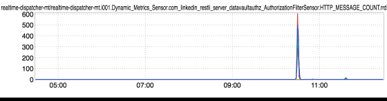
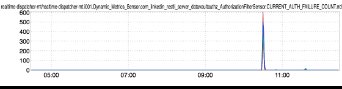

+++
title = "Datavault & D2"
date = "2017-04-27"
slug = "datavault-d2"
draft = false
+++

*[Attribution for the meat of this week's post goes to* *Akhilesh Gupta**, whose email I ripped off more or less verbatim below. Also, huge shout-out to Max* *Wolffe and the Datavault team for the investigation leading up to that email.]*

Here are a couple of interesting inGraphs:

Don't adjust your dial, folks...these are two different inGraphs of two different metrics. The first is a datavault metric representing the HTTP message count to a service. The second is another Datavault metric representing auth failure counts to that same service. Pretty tight correlation, right? In order to understand what's going on here, a little bit of background on _Datavault_. Per the link:

The Datavault project aims to:

Encrypt inter-service communications, both within and between data centers Optionally, authenticate inter-service calls; that is, to answer the question "who is calling me?" Optionally, authorize inter-service calls; that is, to enforce rules about which callers are allowed to do what

Okay, so encryption between services, authentication of callers (in Datavault parlance: "principals"), and authorization for those principals. Another bit of helpful background for those not super-familiar with D2: It allows for announcement using multiple protocols as well as prioritization of which of those protocols to prefer. For instance, a service might announce over both HTTP and HTTPS for a given endpoint, and specify HTTPS_FIRST (meaning "Prefer HTTPS, unless the service is unavailable or exhibiting degraded performance over HTTPS in which case fall back to HTTP.") This capability is important for understanding what happened here. In AK's own words:

For a datavault enabled service with a d2 prioritized scheme of HTTPS_FIRST the following sequence of events can happen in case of degradation in performance:

a.  Service has degraded performance because of any reason (e.g., High/Long GC rate during a traffic shift into a colo) b.  Latency for establishing connections and response times increase c.  d2 sees that the service is degrading and switches to HTTP for the service d.  All requests to the service are now over HTTP and thus, the Datavault principal is NOBODY e.  Datavault denies all requests and every request results in a 403 f.  Upstream services see 403s and degrade in a chain reaction and see the same issue propagate upwards in the chain

So...what to do about it? Well, d2 **also** supports a prioritization scheme of HTTPS_ONLY, which does exactly what it sounds like and is almost certainly preferable if your service is going to reject all HTTP traffic due to an unauthorized principal.
