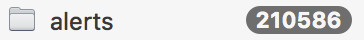
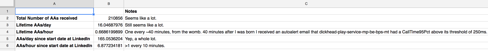
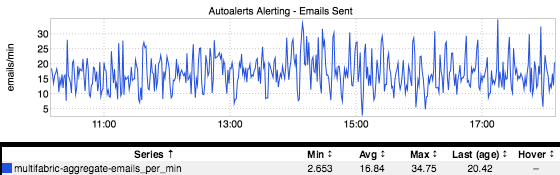

+++
title = "Not Even Wrong"
date = "2017-05-04"
slug = "not-even-wrong"
draft = false
+++

I'm an O365 early adopter and guide...which has fuckall to do with anything, except that as Outlook has been syncing a number caught my eye:

Huh. Over 200K alerts since I started at LinkedIn. I dumped some numbers into a spreadsheet to take a look at some averages:

I got a little curious - is this Just Me, or do other folks see this same kind of email volume? Well, _David De Maagd_ hooked me up with this inGraph:

_The legend says "emails/min", but David De Maagd_ and I figured it's more likely to actually be QPS (we agreed to blame Jimmy for the discrepancy in the legend). So it could be off by a factor of 60 but assuming it   QPS this means >60K emails an hour. ~1.5M emails/day. Half a billion emails a year. This **is** doesn't even speak to the number of recipients - each of these emails could be to a distribution list with God knows how many people on it.

"Well, but email is cheap. Who gives a fuck, Cliff?" you ask. Who gives a fuck, indeed.

I wanted to call this post "Alert Fatigue" but that doesn't actually describe the phenomenon. I'm not "fatigued" by these alerts in the sense of being weary. They're filtered. I do not see them, I do not think about them. These alert emails impose zero cognitive load upon me until someone forwards one my way with a "Hey, is this a Thing we should Worry About?" This may make classify me as a Bad SRE - hit me up some time, we'll talk about my inadequacies. It'll be fun.

...but it puts me in mind of one of my favorite insults of time:  ['"It s not even wrong". (Side note: This is the most subtle and deeply-cutting insult I'm aware of. ](https://en.wikipedia.org/wiki/Not_even_wrong) I love it.) The alert asserts a claim - "This is important enough to alert on!" - but presents no evidence at all that can be falsified by experiment. Someone Somewhere decided that mebbe they didn't want their thing to go to eleven, so now an email gets generated when it hits 11.01. Who does this help? And how?

Think about your alerts, folks. I know there is a preponderance of tech debt wrt "alert creep" and the Truly Important shit should be calling you anyway, but at the very least keep an eye on new email alerts being onboarded.
