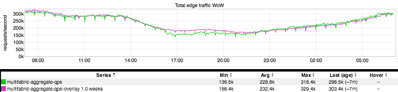

+++
title = "Subtlety"
date = "2017-05-11"
slug = "subtlety"
draft = false
+++

One of the things I love about inGraphs (or really, graphs/visualizations in general) is the information density - the amount of information that can be conveyed in a relatively small amount of space. Granted, it takes some time and experience to really grok what you're looking at, but once you've invested that time inGraphs like this one really hit home:

See that dip there in the middle? Subtle, right? Well...that "little" dip is LinkedIn dropping something on the order of 20% of all traffic at the network edge. As you might imagine, this perturbed a certain set of folks to the degree that they dropped everything and spent all night un-fucking the situation...spent all night making the bright green line re-align with the pink line (fuschia? What color is that, anyway? ...and who the fuck picked that for the week-over-week color in the first place?).
