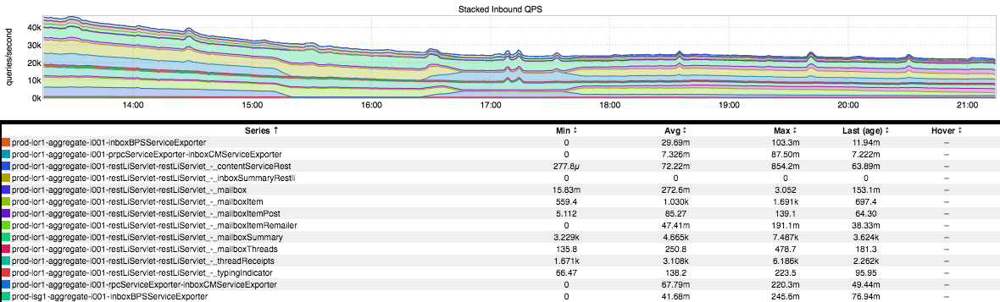
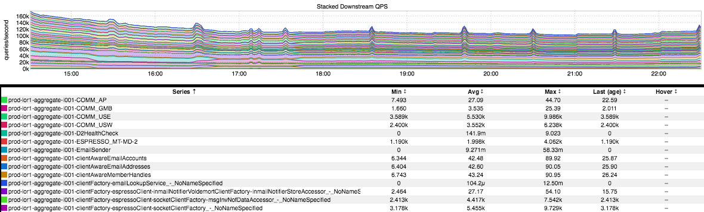
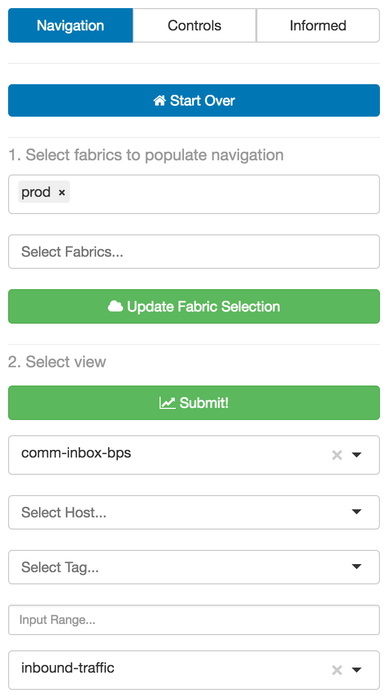

+++
title = "Dynamic Dashboards"
date = "2017-05-18"
slug = "dynamic-dashboards"
draft = false
+++

This week's post is (hopefully) an educational one for folks who aren't super-familiar with inGraphs. The concept came from _Alexsandra McMahan, and the _ idea is the following:

"Suppose LinkedIn is down, what are the first three inGraphs I should look at?"

Hmm...damn near infinite scope. I could give you any three inGraphs and they would be the wrong ones to look at for any given site outage. So let's scale it back a bit:

"Suppose LinkedIn Messaging isn't working, what are the first three inGraphs I should look at?"

Ah, now with a little bit of domain knowledge about how Messaging works at LinkedIn we can say "Well, comm-inbox-bps is the core service doing a lot of the 'heavy lifting' for Messaging, so let's take a look at that." So what does **that** path of investigation look like, supposing we've narrowed things down to an individual service?

Well, assuming you don't have 3 lovingly hand-crafted bespoke YAML files that you've vigilantly kept updated, whose names you happen to know by heart that describe everything you could ever want to know about anything that exists in Your World (hint: you don't; at present there are 23776 dashboards in the common-templates directory, betcha less than 2% of them are actually worth a damn for anything beyond alerting on things like fucking nuage quotas) then you might consider leveraging a wonderful feature of inGraphs: dynamic dashboards.

"How do I even dynamic dashboard?" Here's how:

[http://ingraphs.prod.linkedin.com/container/comm-inbox-bps/?dynamic=inbound-traffic](http://ingraphs.prod.linkedin.com/container/comm-inbox-bps/?dynamic=inbound-traffic)

Supposing you know the name of your container (replace "comm-inbox-bps" with the container you wanna see) this provides a wealth of interesting information: inbound QPS, 95th percentile latency, and error rate. Just one example is the stacked QPS graph that shows up at the very top:

So lovely. The rise and fall of site traffic, occasional traffic spikes (likely due to batch traffic - but usually batch emails happen at the top of the hour and these are all at roughly half-past so omg what is going on here I wanna know), traffic shifts...it's all there, and more.

But suppose you want to investigate whether a downstream service is causing the issue? Well, maybe you take a look at something like this:

[http://ingraphs.prod.linkedin.com/container/comm-inbox-bps/?dynamic=downstream-traffic](http://ingraphs.prod.linkedin.com/container/comm-inbox-bps/?dynamic=downstream-traffic)

Similar to the inbound-traffic inGraph this gives a whole pile of interesting information about what your service thinks is going on with the services it's calling as a client (QPS, p95 latency, errors).

This is already a long-ish post, I've only talked about 2 dynamic dashboards, and I've only posted QPS graphs (which are possibly the **least** interesting inGraphs in dynamic dashboards in a lot of cases)...but there are more!

Fiddle around a bit with that dropdown that says "inbound-traffic" in the screenshot - let me know what kind of cool shit you discover!

