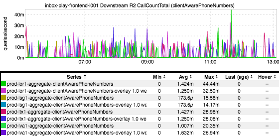
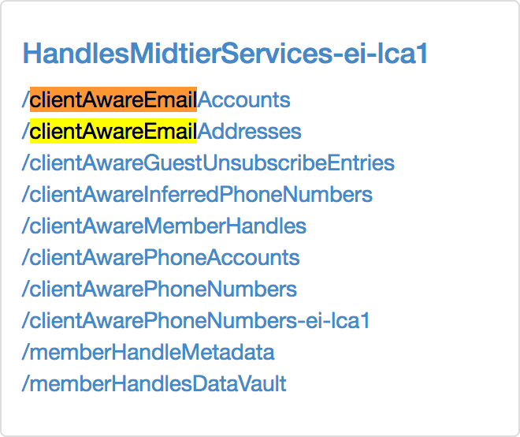
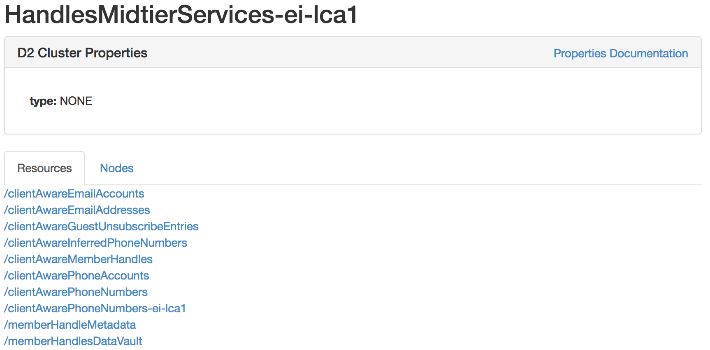
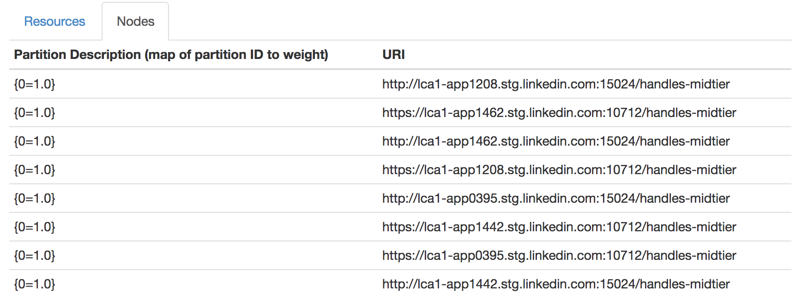

+++
title = "What's That Downstream?"
date = "2017-05-25"
slug = "what-s-that-downstream"
draft = false
+++

In _last week's post we took a look at the dynamic dashboards feature of inGraphs. One of those was the downstream-traffic dashboard, which gives a _ bunch of useful information about endpoints that our service is calling. ...but what if we wanted to know what the actual name of the service serving that endpoint is? For instance, suppose it's busted and we want to look it up in [go/owners so we can escalate to the appropriate person. Or, if we want to be ](http://go.corp.linkedin.com/restli) more optimistic, maybe the error rate went down and we want to reach out to offer the service owner a congratulatory scotch and a cigar. How would we go about doing that?

Well, let's start with the inGraph:

This inGraph shows QPS from inbox-play-frontend to the endpoint **/clientAwarePhoneNumbers**. Maybe we've seen that endpoint before so we Just [Know what the name of the service is, but supposing we don't a reasonable next step might be to take a look at go/restli and do an in-page search for it:](http://go.corp.linkedin.com/restli)

Ah, there it is! So now we know the cluster to which the service belongs (in d2 parlance an endpoint is a "service", which is a part of a "cluster" of [services). ...but go/owners](http://go.corp.linkedin.com/owners) doesn't key off of d2 cluster names, it uses service names. So how do we find that?

<sigh> Well, here's the part where you're going to start hating me.

First off, click on the cluster name (in this case, HandlesMidtierServices-ei-lca1). You'll see a page that looks like this:

Click on the "Nodes" tab, and you'll see something like this:

"Oh, cool! The root context path is **/handles-midtier**, so that must be the name of the service...right?" Err...well...in this case, yes...but not always. The root CP is the same as the service name in a lot of cases and will at the very least (almost) always give some hint as to the service name (in the same way that the d2 cluster name does), but it needn't necessarily be the actual service name. In order to that, we'll grab the port number it's listening on and turn to porter. For completeness' sake I grepped for both the http and https port, but in practice this shouldn't be necessary - either one should be fine.

$ porter list | grep -e 15024 -e 10712 10712 | handles-midtier | i001 | https | None | False | SSL port 15024 | handles-midtier | i001 | http | True | False | container port

Aha! And now we know! handles-midtier is the service name. (Please, God, if there is someone out there who knows of a better way to map an endpoint to a service name I'd love to hear about it in the comments...)
