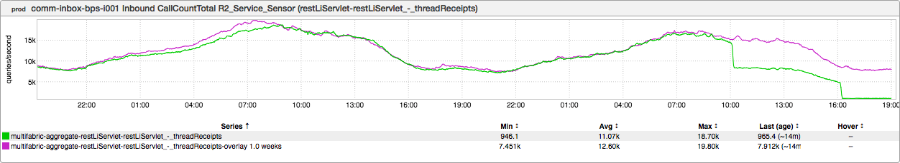
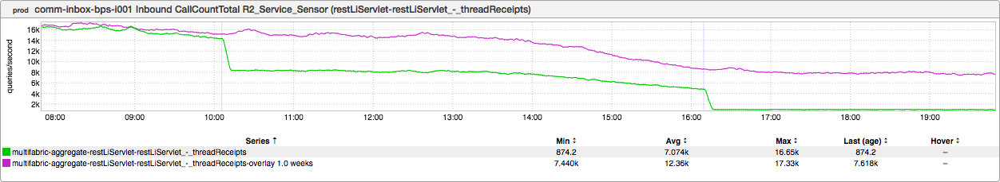
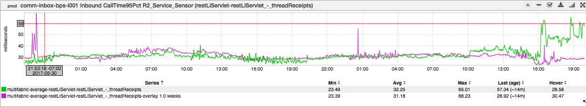

+++
title = "Less is More"
date = "2017-06-01"
slug = "less-is-more"
draft = false
+++

This week I stumbled across an inGraph of Beauty almost completely by accident:

_It actually started out as an inGraph of Panic - I wasn't expecting something quite this dramatic - so I reached out to Swapnil Ghike__ and Aniruddh _ _Chaturvedi_ (the oncall) to figure out what was going on (thanks, guys!) As it turns out (o continue to name-drop): _Jeffrey Schang ramped a lix that actually _ decreased the overall QPS to this endpoint:

This zoomed-in view has light blue lines where the lix was ramped (sorry, it's subtle - look hard!). The dedicated reader might recall [a previous post in ](/igotw/2017-04-06-cascading-failure/) which I alluded to the fanout to the /threadReceipts endpoint. I didn't call it out explicitly in that post, but that fanout was something on the order of 20-to-1; for every upstream call to voyager, ~20 calls were made to this particular endpoint. Well, this ramp batches up those calls.

Now, a bit of realism:

I suppose nothing in life is free. So there's an increase in latency - that's to be expected; 20 calls for individual records are likely to take less time (on average) than a single call for 20 records, right? On the whole, it's a big win. (Please, hit me up if you don't understand why. Hint: Take a look at the magnitude of difference in QPS as compared to the magnitude of difference in latency.)
