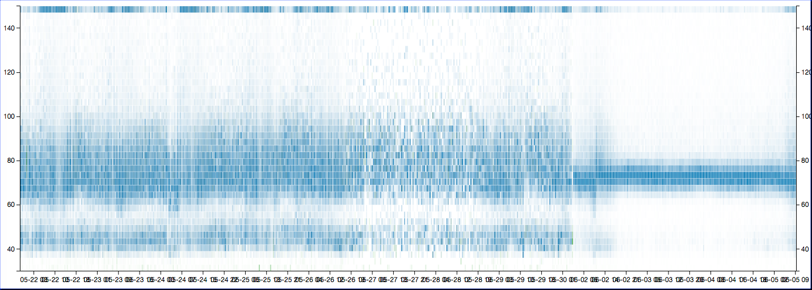
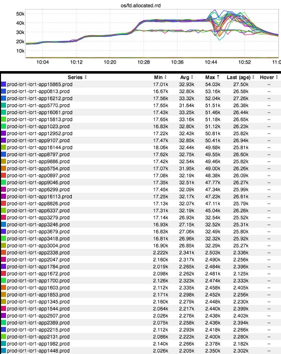
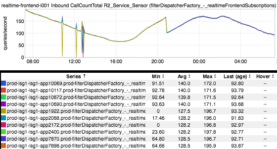

+++
title = "Unintentional Art"
date = "2017-06-09"
slug = "unintentional-art"
draft = false
+++

_Kicking it off with something other than an inGraph, here's a latency heatmap Kurt Andersen_ shot my way:

I'm still chewing on it a bit, trying to figure out the reasons for the pretty obvious convergence around 6/1...but it's here in a UA post because it looks fucking sick.

Next up:

This nifty lil feller is what happens when you uplift a service that has explicitly-defined ulimits. Unfortunately, the service comes up before range has sync'd, which means the cfengine machinery that pushes out those limit changes hasn't had a chance to kick in yet (and thus you get the default values on the newly-added nodes). See that handful of "stragglers" plateauing at around 30K? Yep, 30K would be the default limit for open files.

Another nifty uplift graph:

That little cleft around 21:00? Nodes being added and the per-node QPS getting re-distributed.

...and finally:

This just looks like some kind of stylized dagger or something, so I figured I'd drop it in here.
