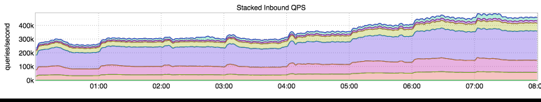
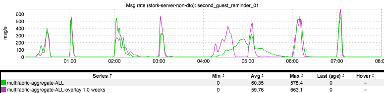
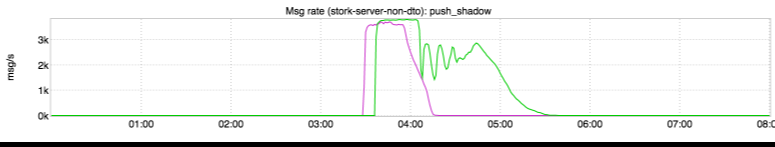

+++
title = "Cadence"
date = "2017-06-15"
slug = "cadence"
draft = false
+++

Consider the following inGraph:

The first thing that might come to mind when looking at the legend is "Lord Almighty, look at all the QPS!" Sure.This is an inGraph of inbound traffic to identity-mt - one of the highest-traffic mid-tiers at LinkedIn. If you're doing anything at all that requires member profile data then you're talking to identity-mt, and that use case covers a pretty broad swath of the site. Looking a little more closely there are these little "perturbations" on hourly boundaries. Why is that? Well, largely due to batch traffic, a significant portion of which is email traffic. For example:

This is an inGraph of email sends for a particular email campaign adhering to the concept of "Delivery Time Optimization" (DTO). The idea behind DTO is that there is an optimal time at which to deliver an email to a member - a time when that member is most likely to see that email and take action on it. The spikes in sends "follow the sun", so to speak; if we've determined (through A/B testing) that a member is most likely to open an email and click on it at, say, 09:00, then we strive to deliver the email to that member's inbox at 09:00 *in that member's time zone*.

So...why did things kind of get all fucked-up and "smushy" around 04:00, spreading out the sends into the 05:00 hour? I have to admit that I don't know in this particular case. One common way that this can happen is another high-volume campaign that happens to be sending at the same time using the same kafka topic; for instance:

As we all know, the Internet is a series of tubes and sometimes those tubes can get clogged. Absurdity aside, the analogy is actually a pretty close fit in this particular case. Hit me up if you're interested in the particulars of why/how one email campaign can impact another - it's outside the scope of this post,

but the tl;dr is "shared 'tubes' and per-campaign rate-limiting".

