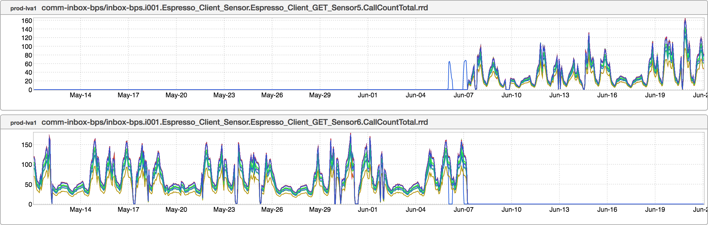

+++
title = "Duplicate Mbeans"
date = "2017-06-22"
slug = "duplicate-mbeans"
draft = false
+++

Once a month or so I get a Slack DM from one of my engineers. (S)he is typically - but not always - new to the oncall rotation, and trying to shepherd the canary & subsequent promotion of a new release of some jankitudinous old code with a handful of new commits. The ask typically takes the following form:

"Hey, can you please help me take a look at this EKG? It's got this weird thing that I don't understand on the Fanout tab and I don't know whether I should ignore it or not."

Sure, happy to help. I wish I had a had a screenshot of an EKG report to show here - I may add one in the future if I can dig one up - but the way this looks in inGraphs is almost always something like the following:

Note that the titles of these two inGraphs are almost identical. The only distinguishing factor is that one has a "5" in its name whereas the other has a "6". To give an example in terms of the EKG Fanout table: the Current/Canary column (the "6") drops from, say, 80.92 to 0...and the Baseline column (the "5") jumps from 0 to 80.92. To perhaps make this more clear: one metric name gets replaced by another.

The conversation from there forward:

"Dude, this happens all the time. Let's fix it. Also: Does your team have like a runbook or a wiki page or anything that speaks to common release issues? Or do they just kinda throw you to the wolves?"

"haha inorite...so...false positive? I'm good to promote?"

<sigh> Okay. Let's root-cause this and try to understand how it happens. *(****Disclaimer:*** *I am about to enter into a realm in which I am far from being an* *expert; if I am misunderstanding any of the particulars,* ***please*** *correct me in the comments.)*

1. A component - in this case, the Espresso client component - is wired into a service multiple times/in multiple places.

2. Each of these client components registers an mbean for keeping track of metric counters. The name of the mbean is generated by mangling together some combination of strings which includes the component name.

3. Because there are multiple identical component names being registered, the container logs a warning about "duplicate mbeans" and uses a strategy of appending an incremented integer to each subsequent identical name that is registered.

4. The order in which these duplicates names are registered may not necessarily be the same for each deployment.

5. Only a subset of these mbean counters end up getting incremented for any given metric (the reason for this escapes me...I'd have to spend some time digging in to figure this one out).

