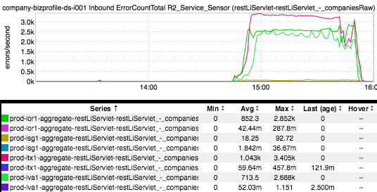
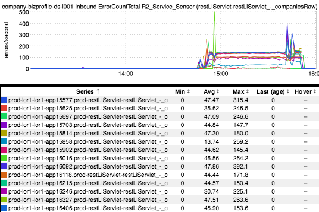
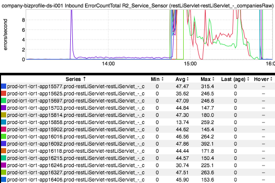

+++
title = "Canary Redux"
date = "2017-06-29"
slug = "canary-redux"
draft = false
+++

[I've come back to the innaugural igotw post](/igotw/2016-01-07-not-learning-from-mistakes/) on more than one occasion. It never ceases to amaze me how relevant it continues to be. A similar situation - in the form of [a Major GCN](https://jira01.corp.linkedin.com:8443/browse/GCN-23719) - happened earlier this week. I say "similar" in that some canaried code showed the errors (and was promoted all the same). Let's dive into just how similar it was (or wasn't). First up, let's take a peek at error QPS for the busted service in all fabrics:

The errors are super-apparent after the promotion and certainly fall off after the rollback, but there's not much visible prior to that. Where are the canary errors? Maybe if we focus in on a single fabric:

Still really nothing leading up to the GCN. What if we drop the week-over-week overlay, pick a single fabric (say, prod-lor1), and de-aggregate the data. Let's see whether the individual canary host stands out:

Hrm. Okay. Still not much to go on. What if we set an upper bound - say, 10.

Ah! There she is! That thin purple line of errors - that's our canary, that's what we were looking for!

...but this is still a bit dissatisfying. The canary errors from [the previous post were super-obvious, right? They jumped high and stayed high. Why didn't that ](/igotw/2016-01-07-not-learning-from-mistakes/) happen this time? Why did the errors spike briefly and then level off at some rate that was almost indistinguishable without putting it under a microscope?

Well, in this particular case the endpoint we're talking about is a d2 endpoint. One of the features of the d2 client is that it attempts to route around failures; i.e., it explicitly sends less traffic to misbehaving nodes - the ones that are slow, throwing errors, etc. If **all** of the nodes are throwing errors then there isn't much that can be done (as can be seen after the canary was promoted)...but what if it's only one node?

Routing around failure is a super-nice feature to have, but this got me thinking. We deploy canaries to individual machines in order to both limit impact and find code breakage before exposing it to all members. But - and this is the crucial bit - *if d2 is routing traffic around busted canaries then we're not exposing* *the very failure modes that we intend to expose via canarying.*
