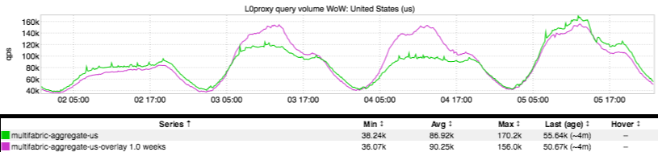
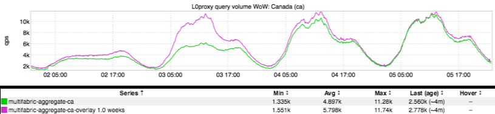

+++
title = "Independence (and Canada!) Day"
date = "2017-07-06"
slug = "independence-and-canada-day"
draft = false
+++

Just like [last year](/igotw/2016-07-07-4th-of-july/), I thought we could take a look at what US site traffic looked like around the Fourth of July:

"But Cliff," my Canadian friends want to know, "Canada happens to have a major holiday around this time, too! Why don't you show us Canadians a little [love? (And no, that one time you put a side note about how Canadians tuned into the Superbowl to watch Coldplay](/igotw/2016-02-11-the-superbowl/) doesn't count.)" Well, I don't want to disappoint:

Happy Canada Day, folks!
