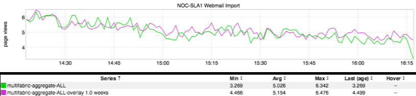

+++
title = "Before You Panic (Metric Lag)"
date = "2017-07-13"
slug = "before-you-panic-metric-lag"
draft = false
+++

It's almost a rite of passage for inGraphs newbies to run across an inGraph like the following and flip out:

"Oh my God! This metric has dropped right to the floor in the past couple of minutes! Spin up a GCN, let's Engage Dudes and get to the bottom of this!" They're correct - it certainly does look alarming! - but hopefully they run it by someone with a little more experience using inGraphs before rounding up the cavalry. See, there's a bit of propagation delay in metrics collection. If you refresh this inGraph a couple of minutes later you'll see it even out/come more in line with week-over-week (assuming something isn't **actually** broken). ...and the more metrics you're aggregating, the more likely the leading couple of minutes are to be inaccurate.

The Lesson: Understand the limitations of the system. Due to this metric lag you basically cannot trust the most recent few minutes' worth of data in inGraphs.
