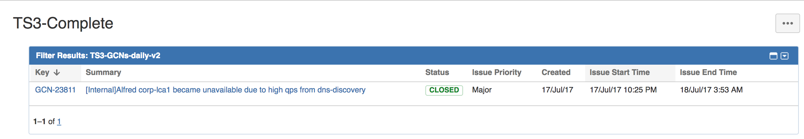
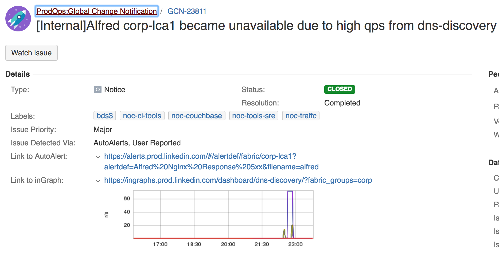
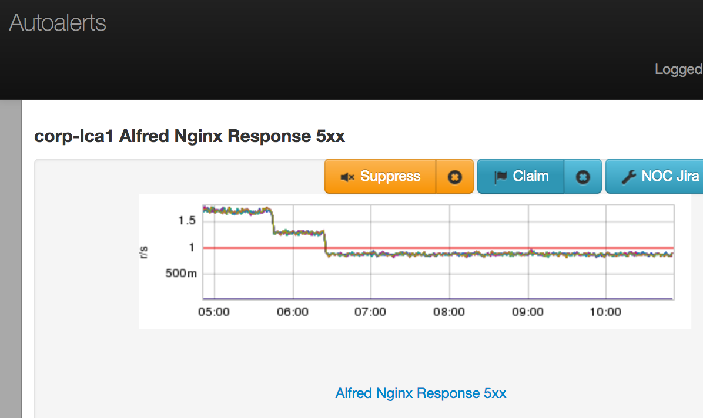
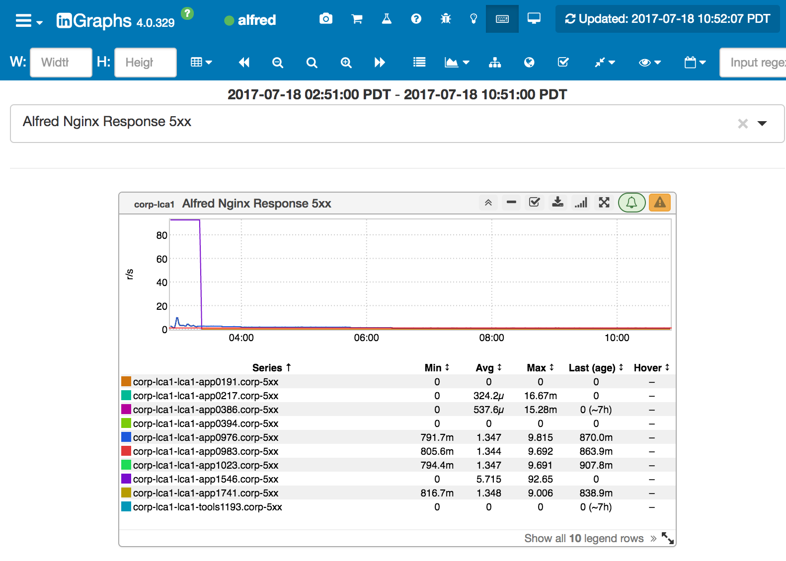
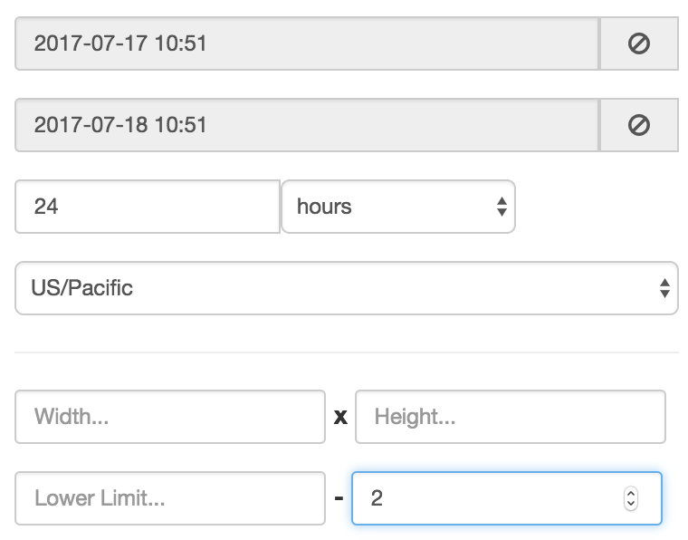
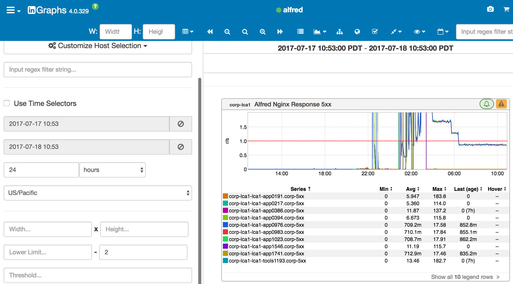

+++
title = "Below Threshold"
date = "2017-07-19"
slug = "below-threshold"
draft = false
+++

*[This week's post was submitted by Chris Carini. Thanks for the awesome find and great write-up, Chris!]*

Today ( 18 Jul 2017 ) at TS3, there was an Alfred GCN that had happened during the night and our wonderful colleagues in Bangalore took care of the issue. Awesome!

**The input**

Found at [go/ts3dash this morning, the closed GCN; cool, everything is better now that it's closed, right?...](http://gots3dash/)

**The trail**

Of course... the link and screenshot to the inGraph looks like it did before!

^ [[link](https://jira01.corp.linkedin.com:8443/browse/GCN-23811)]

And the AutoAlert looks normal; the metric has dropped back below the set threshold for the AutoAlert:

^ [[link](https://alerts.prod.linkedin.com/#/alertdef/fabric/corp-lca1?alertdef=Alfred%20Nginx%20Response%205xx&filename=alfred)]

inGraph looks ok too:

^ [[link](http://ingraphs.prod.linkedin.com/dashboard/alfred/graph/Alfred%20Nginx%20Response%205xx?fabrics=corp-lca1&timezone=US%2FPacific&use_time_selector&start_time=1500371700000&end_time=1500400500000)]

Dude, why the heck am I looking at all of these, this looks fine, GCN closed; get over it, move on...

But what happens if we tweak the inGraph a bit for some more context, let's look at 1 day instead of the default 8 hours, and let's truncate off the 'high' data points causing the GCN:

**The reveal**

/me clicks submit

^ [[link](http://ingraphs.prod.linkedin.com/dashboard/alfred/graph/Alfred%20Nginx%20Response%205xx?fabrics=corp-lca1&timezone=US%2FPacific&upper_limit=2&use_time_selector&start_time=1500313980000&end_time=1500400380000)]

Notice something a bit off now??

Even though the metric has dropped below the threshold, it appears that it's not the same as it was before the issue started. Specifically, there are 4 nodes that seem to not be in the same general state as they were beforehand. Might there be another issue here that's just happening to skate by the radar (AutoAlert)? Possibly. Is this totally worth pointing out during TS3? Oh yeah. The team didn't seem to be aware of this, and is currently looking into what might be causing this excessive 5xx response.

**The lesson**

It's always worth taking a slightly deeper look at various things; in this case, a bit of inquisitiveness lead me to quickly (within 2 minutes) identify something else that might be going on, and certainly worth the team investigating further. Always try to understand the full picture; looking back a bit more in time gives me an uneasy feeling; this metric has always stayed very close to zero, and now it's fairly close to the AutoAlert threshold? Seems fishy. And worth bringing up during TS3 to the team to take a further look. Maybe some great finding comes from this and an ancillary issue is found; maybe not, but worth finding the answer either way.
