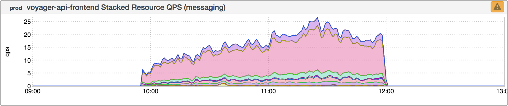
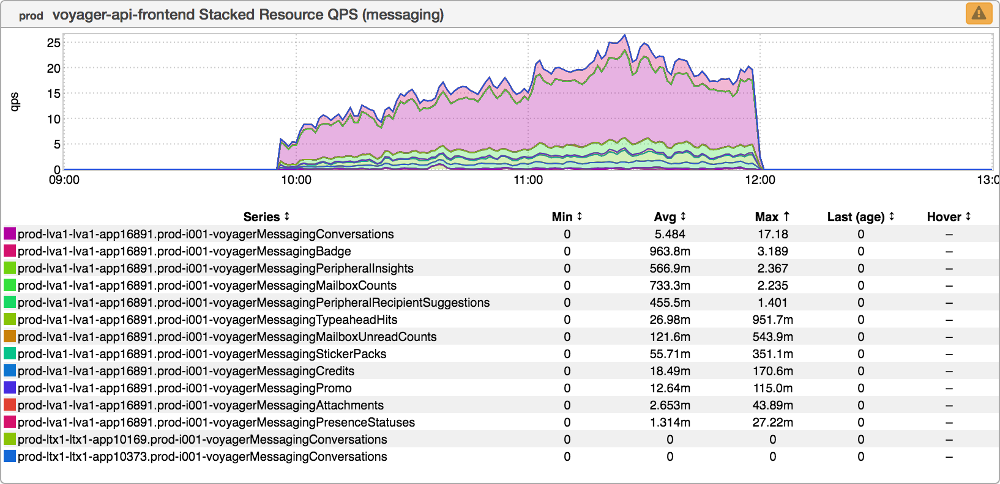
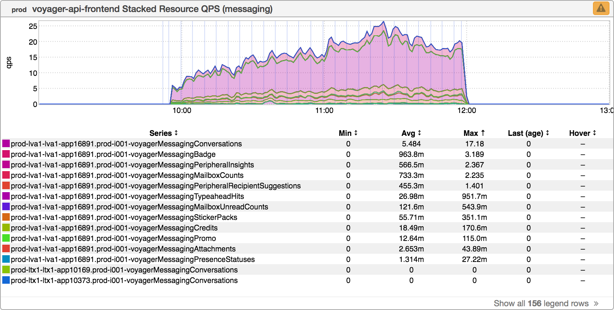
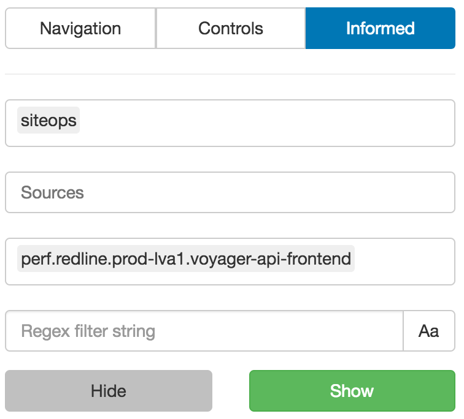

+++
title = "Informed Overlay"
date = "2017-07-28"
slug = "informed-overlay"
draft = false
+++

In this week's post I'd like to highlight a Killer Feature of inGraphs that I think I've demonstrated before but never posted about explicitly (at least not that I can find): the informed overlay. [Informed](http://informed.corp.linkedin.com/) is a tool at LinkedIn that accepts messages about events from various sources - deployments, lix ramps, etc. - and stashes them away in the hopes that if someone wants to figure out what happened after the fact that information will be available. Somewhere along the way someone said "Hey! inFormed has timestamps on each message it receives - wouldn't it be cool if we could let people search for events in inFormed inside of inGraphs and showed a vertical bar for each inFormed event that matched the search?" ...and thus was the inFormed overlay born.

More on that in a minute. Let's take a look at an inGraph:

It may not look like much but this is traffic that "never should have been", so to speak. Allow me to explain. For those unfamiliar with Voyager, it is currently in the process of being split into multiple different clusters. Each cluster will be responsible for handling the traffic for a particular pillar - a logical grouping according to a particular business function (roughly speaking). The Messaging pillar was the first such pillar to be split into its own cluster. In spite of the labelling on this inGraph, it actually represents Messaging traffic that has been directed to the "main" cluster (instead of the Messaging cluster). It's not a lot of QPS...but it's odd.

_Well, let's dig in a bit and de-aggregate_:

[Curiouser and curiouser. Sorting the metrics by Max, It would appear that this traffic is going to a single host - lva1-app16891. Doing a code search](http://jarvis.corp.linkedin.com/codesearch/results?query=lva1-app16891) on that [hostname reveals a range YAML file](http://jarvis.corp.linkedin.com/codesearch/result/?name=prod-lva1.voyager-api-frontend.1.yaml&path=itops%2Frange&reponame=lirepo%2Fitops) that specifies this particular host as a redliner host. Ah, now we're getting somewhere. Redliner is controlled by lix...so what if we poke around a bit using the informed overlay to look for voyager-related redliner ramps? A bit of trial-and-error later and we come up with the Golden String: perf.redline.prod-lva1.voyager-api-frontend.

[A-ha! Correlation does not imply causation](https://en.wikipedia.org/wiki/Correlation_does_not_imply_causation)...but that's a pretty tight correlation to just be coincidence. (Quick tip: You can Ctrl-drag to get a modal with links to the actual messages in inFormed.) So it looks like there may be a bit of a bug in redliner that results in redline tests directing traffic to the wrong cluster. There needs to be some follow-up on why this happens, but yay! We've learned something that would've been otherwise very difficult to piece together

without the inFormed overlay feature.

**Update:** I'm not generally in the habit of updating posts after the fact, but _Nick Berry asks: "_What did you have set for source, keywords or regex filter string to get that result?" Good point, Nick - I talked about **what** I did, but now **how** I did it. Here's a screenshot of the informed tab in the UI that I used to generate this result:

To address questions about specific fields:

**What Topics?** You will almost never need to fiddle with this. It's **siteops** by default, and this is almost always the one you will want to use. **What Sources?** I generally leave this blank unless I have a very specific idea of what I'm looking for (for example, if I know the thing I want is a LIX). Leaving it blank will search all Sources, which is more often what I want when I'm investigating something and I'm not entirely sure what I'm looking for. **What Keywords?** You can see the keyword string I used in this example. It took me a few iterations of refining to get there - for instance, in this case I probably started with "realtime", noticed some redliner runs and filtered on "redline", etc. until I finally ended up with the specific lix key I was looking for. I've also filtered on things like "canary", "ATS", etc. Now, informed can be super-noisy (to see what I mean, try looking at the overlay without a keyword specified - it's nuts), but generally with a bit of trial-and-error you can narrow it down quite nicely. **What Regex?** Honestly, I never ever use this. I don't know exactly what it's "filtering" but I have never been able to get it to give me any kind of good result. *Keyword* does what I want it to do, so I just use that.
