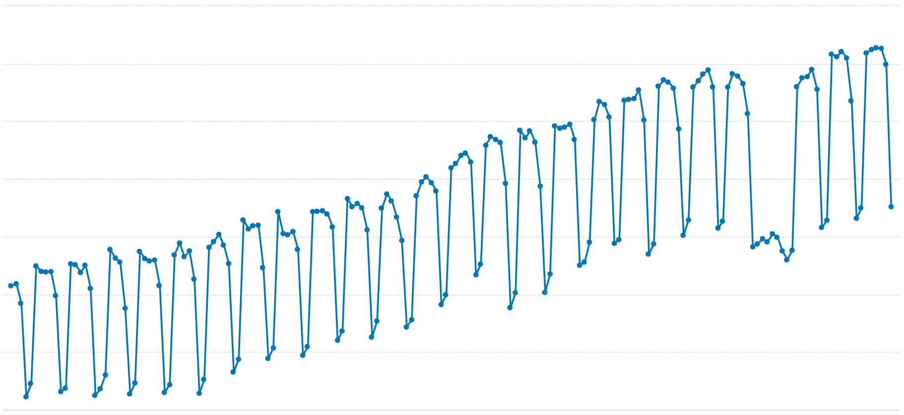
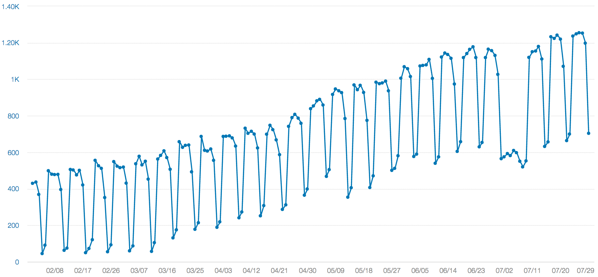
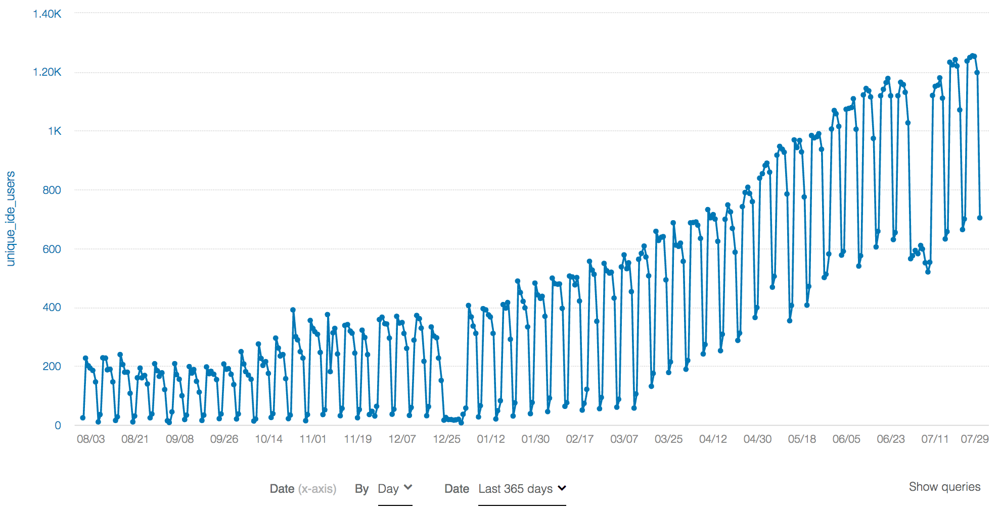
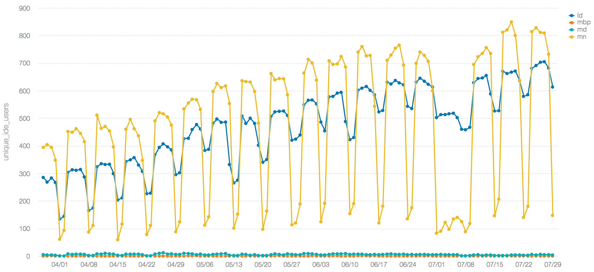
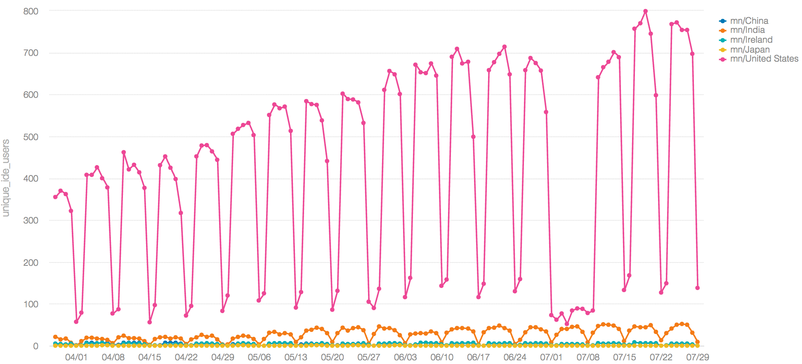
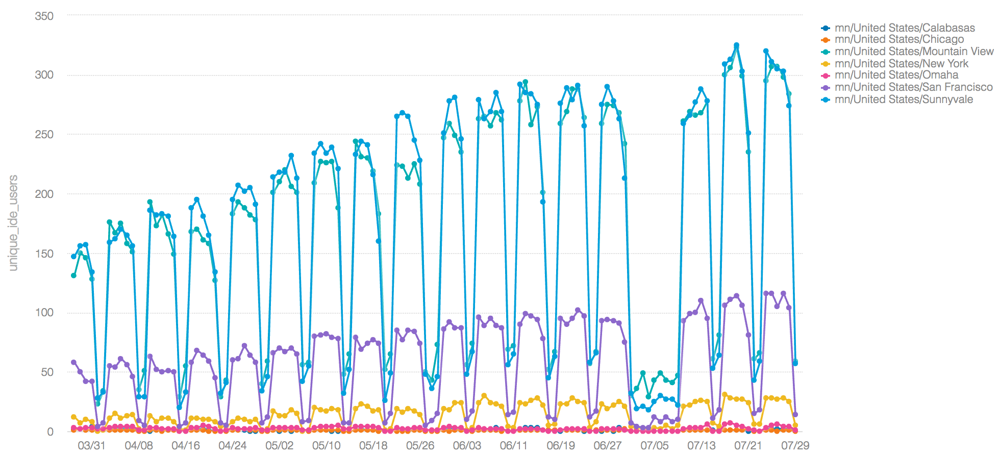

+++
title = "What's That Dip?"
date = "2017-08-03"
slug = "what-s-that-dip"
draft = false
+++

*[Once again, this week's igotw comes from* *Chris Carini. Thanks again, Chris - keep this up and I'll have to rename this blog "The Weekly Carini"!* *]*

Below is a metric my team follows fairly closely.

It looks like we've got a normal pattern here, a fairly consistent oscillation, and then all of a sudden, it flat lines for a bit, and resumes it's normal pattern. In general, we're trending upwards

"What the heck is going on here?!" you ask in a fit of fury.

Ok, ok, I'll provide a bit more information.

Did that help any? I gave you the axis values. (That's really the best hint I can give you without spilling the beans).

*Beans spilt.*

Notice how the dip is the week of July 3rd - aka one of the longer _Company Holidays_ for those in the US - July 4th Break.

"Wow, that's pretty neat Chris! What metric are we looking at to see this?" you might ask.

Well, this specific graph shows the users of LI IDEA. The consistent dips are weekends.

Similar to the July 4th Break, we can also see a similar drop during the Holiday Shutdown in late December 2016:

Setting aside the fact that LI IDEA usage has been generally trending up (what our team likes to see!), you might have a similar thought as I did: "Wow... there were ~600 people working over the July 4th Break? So much for a break.."

This number seemed off. Like, way off.

Then I realized something key that is very domain-specific to LI IDEA.

How often LI IDEA emits metrics.

Combine that with some other observations, and it begins to make more sense.

LI IDEA metrics are emitted every 4 hours as a heartbeat. We also know that people tend to not shutdown their desktops at work; they may have local deployments of services running, or some super important cron job to email them the breakfast options in the morning - more realistically, they likely keep various windows / applications open and ready for the next work-day. LI IDEA is one of those applications.

So, what if we break this metric down by machine type:

Ok, now this makes more sense. The blue line is the Linux desktops, while the yellow line is the Mac notebooks. From this, we can see that most desktop users of LI IDEA tend to not close the application on the weekend; ~100 people do. On the other hand, Mac notebook users of LI IDEA tend to close the application (or, rather, not be connected to the network to have the heartbeat emitted - this may mean they aren't connected to VPN, or just keep their laptop closed over the weekend).

"Chris, there's still over 100 people working on their Mac notebooks over the July 4th Break?! That still seems like a bunch."

If we count the number of on-call teams on _go/oncall, it's around 350; so maybe 1/3 of those are development teams and their on-call fired up their laptop _ to see if anything urgent needs attention... maybe.

What if we just look at Mac notebooks, but do a breakdown by Country? Well, we end up with:

Ok, so that dropped the number a bit more. Maybe there are a fair number of employees who decided to use the break to do work!?

Just for excitement and inquisitiveness, let's drill a bit deeper. Let's just look at cities in the US:

Looks like the top cities in the US were Mountain View, Sunnyvale, and San Francisco; no big surprises there, as those are the offices with the most development teams.

Because I'm curious, what if we look at specific buildings? I'm also going to zoom in to just look between July 1st (Saturday before break started) and July 9th (Sunday before break ended).

Do you have any metrics that clearly show company holidays? Perhaps something that is emitting metrics behind a LiX that's currently ramped to just at- linkedin? If so, I'm sure _Cliff Snyder and myself would be interested in checking them out!_

**Update:** A quick plug for LI IDEA from Chris: *"If you're not a user of LI IDEA, you should consider giving it a try! There are many features (**go/li-idea-* *features) including a recently added Go-lang plugin. If you are a user of PyCharm, you will find LI IDEA is very similar, except with many awesome* *LinkedIn specific features. You can find installation information at go/li-idea**."*

