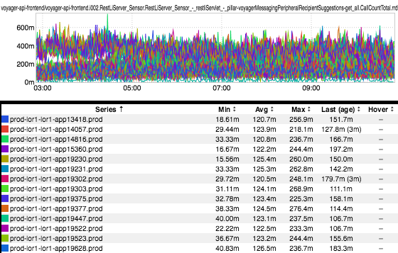
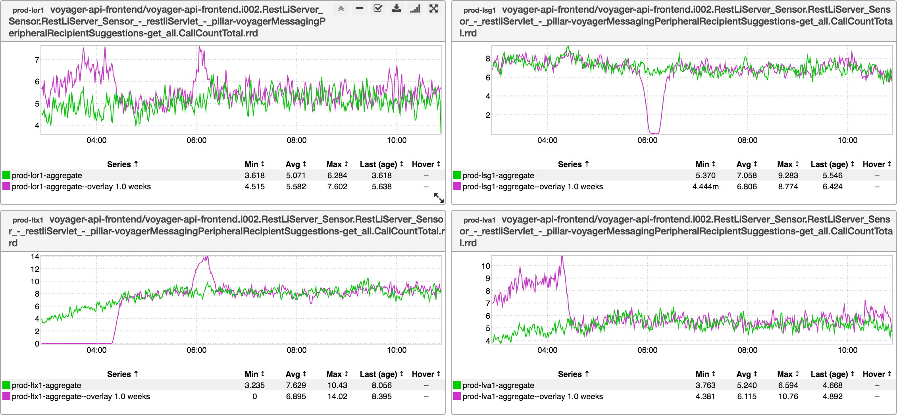

+++
title = "Metric Discovery"
date = "2017-08-10"
slug = "metric-discovery"
draft = false
+++

*[Shout-out to* *Jacky Wang for giving me the idea for this post yesterday!* *]*

I recently had one of my Engineers ask me how to find a metric in inGraphs - specifically, he wanted to know what the QPS to the RecipientSuggestionResource#getAll endpoint looked like. I love inGraphs, but I reckon I'd say it's a bit lacking in the discoverability department. If you know exactly what you're looking for (and how to look for it) then you can find what you need, but if you don't then it can be a bit of a challenge. "It's too hard, don't bother" isn't a particularly reasonable or satisfying response though, so: How *do* we find the QPS to this endpoint in inGraphs? Well, the short answer is: we *don't***.** Rather than going to inGraphs to find what we're looking for, let's turn to our cli and take a look at the metrics tool.

This is typically how I locate a metric when I know what service is emitting it and some part of the name (like the name of the endpoint), but I'm not sure about the rest:

1. Use the metrics tool to grab all of the rrd names for the service and dump them out into a file: **metrics -fg prod list -s voyager-api-** **frontend > voyager-api-frontend.metrics**

2. Do a **wc -l** on that file just to make sure it actually contains metrics - i.e., make sure I didn't fuck up the syntax or something. (*Hint: If the file is 1* *line long, you probably Did It Wrong.*)

3. Start grepping; in this case, something like **grep -i recipientsuggestion voyager-api-frontend.metrics** gets me most of the way there; of the 40K+ metrics in the file this gets me down to around 100, which is a manageable number. I *also* know I'm looking for QPS, so piping that into a further grep on CallCountTotal (which is inGraphs-ese for "QPS") gives me 15 metrics.

4. At this point I can visually pass over the list and pick out the metric I want; specifically: voyager-api-frontend/voyager-api-frontend. i002.RestLiServer_Sensor.RestLiServer_Sensor_-_restliServlet_-_pillar- voyagerMessagingPeripheralRecipientSuggestions-get_all.CallCountTotal.rrd. We're in the home stretch now!

5. [Finally, fire up inGraphs and copy-paste the rrd name as a filter. The url is a bit ugly, but effective: http://ingraphs.prod.linkedin.com/container](http://ingraphs.prod.linkedin.com/container/voyager-api-frontend/?filter=voyager-api-frontend%2Fvoyager-api-frontend.i002.RestLiServer_Sensor.RestLiServer_Sensor_-_restliServlet_-_pillar-voyagerMessagingPeripheralRecipientSuggestions-get_all.CallCountTotal.rrd) [/voyager-api-frontend/?filter=voyager-api-frontend%2Fvoyager-api-frontend.i002.RestLiServer_Sensor.RestLiServer_Sensor_-_restliServlet_-](http://ingraphs.prod.linkedin.com/container/voyager-api-frontend/?filter=voyager-api-frontend%2Fvoyager-api-frontend.i002.RestLiServer_Sensor.RestLiServer_Sensor_-_restliServlet_-_pillar-voyagerMessagingPeripheralRecipientSuggestions-get_all.CallCountTotal.rrd) [_pillar-voyagerMessagingPeripheralRecipientSuggestions-get_all.CallCountTotal.rrd](http://ingraphs.prod.linkedin.com/container/voyager-api-frontend/?filter=voyager-api-frontend%2Fvoyager-api-frontend.i002.RestLiServer_Sensor.RestLiServer_Sensor_-_restliServlet_-_pillar-voyagerMessagingPeripheralRecipientSuggestions-get_all.CallCountTotal.rrd)

Now this is a bit raw, so I might also toss on some aggregation, a WoW overlay, and maybe split fabrics to give something a little more understandable (e. g., [http://ingraphs.prod.linkedin.com/container/voyager-api-frontend/?filter=voyager-api-frontend%2Fvoyager-api-frontend.i002.RestLiServer_Sensor.](http://ingraphs.prod.linkedin.com/container/voyager-api-frontend/?filter=voyager-api-frontend%2Fvoyager-api-frontend.i002.RestLiServer_Sensor.RestLiServer_Sensor_-_restliServlet_-_pillar-voyagerMessagingPeripheralRecipientSuggestions-get_all.CallCountTotal.rrd&fabric_groups=prod&consolidate=Aggregate&overlay_amount=1&overlay_unit=weeks&split_fabrics) [RestLiServer_Sensor_-_restliServlet_-_pillar-voyagerMessagingPeripheralRecipientSuggestions-get_all.CallCountTotal.](http://ingraphs.prod.linkedin.com/container/voyager-api-frontend/?filter=voyager-api-frontend%2Fvoyager-api-frontend.i002.RestLiServer_Sensor.RestLiServer_Sensor_-_restliServlet_-_pillar-voyagerMessagingPeripheralRecipientSuggestions-get_all.CallCountTotal.rrd&fabric_groups=prod&consolidate=Aggregate&overlay_amount=1&overlay_unit=weeks&split_fabrics) [rrd&fabric_groups=prod&consolidate=Aggregate&overlay_amount=1&overlay_unit=weeks&split_fabrics](http://ingraphs.prod.linkedin.com/container/voyager-api-frontend/?filter=voyager-api-frontend%2Fvoyager-api-frontend.i002.RestLiServer_Sensor.RestLiServer_Sensor_-_restliServlet_-_pillar-voyagerMessagingPeripheralRecipientSuggestions-get_all.CallCountTotal.rrd&fabric_groups=prod&consolidate=Aggregate&overlay_amount=1&overlay_unit=weeks&split_fabrics))

Et voila! We've found our metric!

