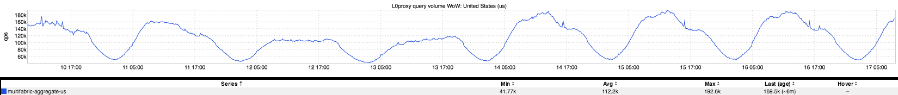
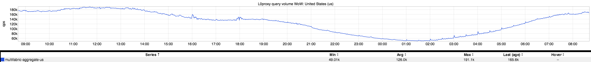
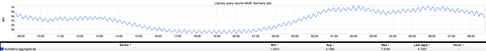

+++
title = "Periodicity"
date = "2017-08-18"
slug = "periodicity"
draft = false
+++

Site traffic tends to follow fairly regular patterns. Barring holidays, world events, sports, etc. traffic generally adheres to a particular cadence. Let's take a peek at a week of site traffic in the US and Germany, respectively:

No huge surprises here. Traffic dips when we'd expect traffic to dip - on weekends, at lunch/dinner, when folks are asleep - and then picks up when everyone is awake and engaged. There is a bit of a shift due to time zone offsets, but overall the pattern is sensible and readily identifiable. ...but why is Germany so damn "fuzzy"? Well, let's take a look at a single day:

Huh. What's up with that, Germany? (Full disclosure: I almost entitled this post "Go Home, Germany, You're Drunk." Decided against it.) I mean, the US has some hourly spikes (likely corresponding to email campaigns or similar), but Germany has this bizarre and regular oscillation - this periodicity - that I have no way to explain.

So weird.

If you happen to know what the fuck is going on here, please let me know.

**Update:** [I've been asked multiple times for a link to the dashboard itself. Here ya go: http://ingraphs.prod.linkedin.com/dashboard/traffic-top20-cc/?](http://ingraphs.prod.linkedin.com/dashboard/traffic-top20-cc/?fabric_groups=prod&multifabric&duration_amount=24&filter=United%20States%20%7C%20Germany&overlay_amount=0&overlay_unit=hours) [fabric_groups=prod&multifabric&duration_amount=24&filter=United%20States%20%7C%20Germany](http://ingraphs.prod.linkedin.com/dashboard/traffic-top20-cc/?fabric_groups=prod&multifabric&duration_amount=24&filter=United%20States%20%7C%20Germany&overlay_amount=0&overlay_unit=hours)
