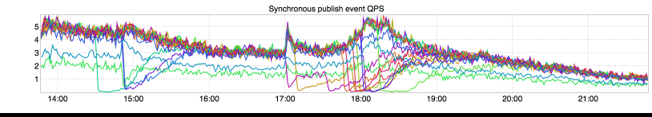

+++
title = "Mystery Post"
date = "2017-08-24"
slug = "mystery-post"
draft = false
+++

_This inGraph was brought to my attention by none other than The Wolffe - Max Wolffe_. Apologies to Max for putting him on the spot, but he has committed to writing up next week's post. So! In that vein: What do you think might be going on here?

I'd love to hear guesses/speculation/opinions/etc. in the comments. If it's helpful, here's the link to the actual dashboard (including timeboxing):

[http://ingraphs.prod.linkedin.com/dashboard/realtime-dispatcher-qps-dashboard/graph/Synchronous%20publish%20event%20QPS?](http://ingraphs.prod.linkedin.com/dashboard/realtime-dispatcher-qps-dashboard/graph/Synchronous%20publish%20event%20QPS?legend=false&override&auto_refresh=1&use_time_selector&start_time=1503521220000&end_time=1503550020000&consolidate=None&fabrics=prod-ltx1&width=734) [legend=false&override&auto_refresh=1&use_time_selector&start_time=1503521220000&end_time=1503550020000&consolidate=None&fabrics=prod-](http://ingraphs.prod.linkedin.com/dashboard/realtime-dispatcher-qps-dashboard/graph/Synchronous%20publish%20event%20QPS?legend=false&override&auto_refresh=1&use_time_selector&start_time=1503521220000&end_time=1503550020000&consolidate=None&fabrics=prod-ltx1&width=734) [ltx1&width=734](http://ingraphs.prod.linkedin.com/dashboard/realtime-dispatcher-qps-dashboard/graph/Synchronous%20publish%20event%20QPS?legend=false&override&auto_refresh=1&use_time_selector&start_time=1503521220000&end_time=1503550020000&consolidate=None&fabrics=prod-ltx1&width=734)

Happy guessing! ...the Big Reveal will be next week!
