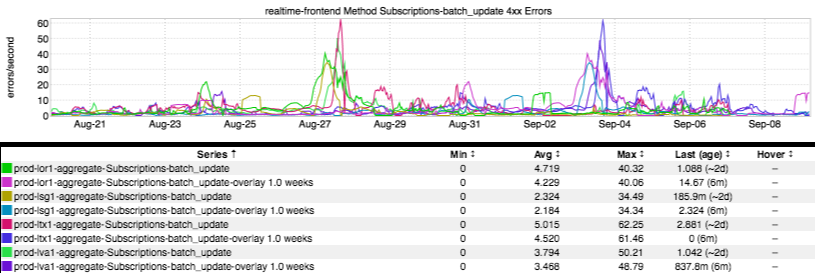
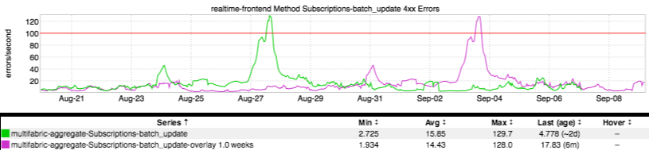

+++
title = "Before You Panic (WoW & Multifabric"
date = "2017-09-07"
slug = "before-you-panic-wow-multifabric-consolidation"
draft = false
+++

**Consolidation)**

It should come as no surprise to the regular igotw reader that it can take some time to get familiarized with inGraphs - to understand what it's trying to tell you, to really grok what you're looking at. Let's take a peek at a (seemingly-)scary inGraph:

Someone without any familiarity with inGraphs might look at this and say "Shit! We saw spikes in errors two weeks in a row! What's going on here?" Well, let's try and untangle that and see whether there's really a Weekly Problem.

The above is a confusing jumble of squiggly lines. There are several ways to make it a little more understandable at a glance. The one I'd like to talk about a bit here is multifabric consolidation (either click the little globe icon in the inGraphs nav bar, or add &multifabric to the query params). In this particular case, we get the following:

_Ah, okay. This is a little more legible. Rather than a heap of lines we now see two - one for current-week (the green one) and one for previous-week (the fus_ _chia one). The legend is also accordingly simplified. So, wha's _**really** going on here: the first spike is the actual spike, the second is simply the week-over- week overlay.
