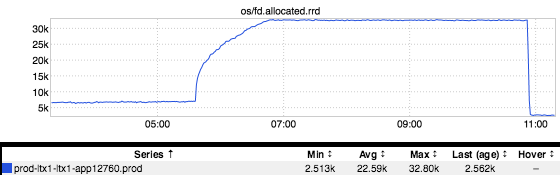
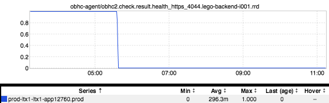

+++
title = "Out-of-Band Monitoring"
date = "2017-09-14"
slug = "out-of-band-monitoring"
draft = false
+++

Earlier today I came across some chatter in a slack channel about one service getting errors calling another service. (I know, I know - the sky is blue, the grass is green, it's Thursday and something is broken on the Internet...this isn't news, who gives a fuck? Bear with me here.) Taking a look at errors metrics for the offending service didn't really reveal anything, but a little poking around in the logs revealed that on one node the service had blown through its open file descriptor limit. This, too, happens frequently enough to not be news...but the tricky bit about this particular failure mode isn't just that the thing is broken, but that the thing is broken in such a way that it cannot reliably report about the fact that it is broken. It may not be able to reliably emit metrics, write logs, etc. The *reliably* qualifier is important here; there may be metrics and logs, but you cannot trust that any metrics/logs being emitted by a service in this state are painting an accurate picture of what's really happening.

So what can we do? Well, let's take a peek at some out-of-band metrics - metrics not directly emitted by That Which is Broken. First, let's take a look at the metric for open file descriptors on that node:

_That line settles in nice and tight right around the default open file limit of 30,000 that we set - as expected, a lovely example of the plateau pattern_. ...but this is really only a symptom. It's certainly not pleasant to the trained eye, but it doesn't indicate breakage in and of itself. For that, we can turn to _OBHC_:

Ah, now we have something a little "meatier". It's outside the scope of this post to get too in-depth about OBHC (feel free to check out the link above, or [this](http://ingraphs.prod.linkedin.com/host/ltx1-app12760.prod.linkedin.com/?fabric_groups=prod&filter=obhc) [one for an example!) but the gist of this metric is that there is a service running out there that does various health checks on your service and emits a "1" if ](http://ingraphs.prod.linkedin.com/host/ltx1-app12760.prod.linkedin.com/?fabric_groups=prod&filter=obhc) [the check passes and a "0" if the check fails. There is obviously a "Who watches the watchers?" problem here - ](https://en.wikipedia.org/wiki/Quis_custodiet_ipsos_custodes%3F)[it's turtles all the way down, after all - but ](https://en.wikipedia.org/wiki/Turtles_all_the_way_down) this kind of monitoring can be super-helpful when a service is so hosed that it can't even tell someone "Bro, I'm hosed."
