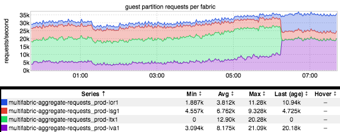
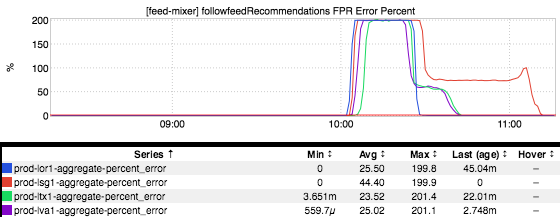
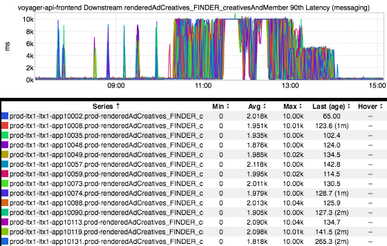

+++
title = "Unintentional Art"
date = "2017-09-21"
slug = "unintentional-art"
draft = false
+++

[I realized today that it's been a good long while since the last time I did a UA post. Well, let's rectify that, shall we?](/igotw/2017-06-09-unintentional-art/)

This one is guest partition requests during a traffic shift, but it kind of made me think of the light cycles from Tron:

An impressive one - 200% errors! - that also happens to look a fair bit like a bulldozer:

...and continuing the "vehicle" theme, this lil guy reminded me of an ice cream truck:

Happy Thursday, folks.
