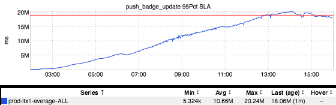
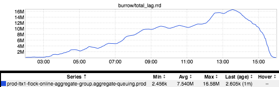
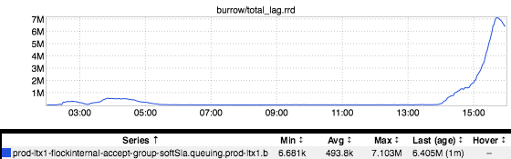

+++
title = "A Series of Tubes"
date = "2017-09-28"
slug = "a-series-of-tubes"
draft = false
+++

As we all know, the Internet is [a series of tubes. Sen. Ted Stevens being a bit of a numnutz aside, sometimes this view of How Shit Works can be helpfully ](https://en.wikipedia.org/wiki/Series_of_tubes) leveraged - in particular, when trying to think about how asynchronous/"offline" flows work. In that vein, let's take a high-level look at how GCN-24373 played out.

The initial report: a particular push notification had gone well outside of its delivery time threshold:

Why does this alert threshold exist in the first place? Well, many push notifications are time-sensitive - if they're not delivered within a certain amount of time then the value of the push is either diminished or lost altogether. In the worst case delivering the push notification too late can actually be worse than not delivering it all.

So why did delivery times climb up-and-to-the-right until breaching threshold (something on the order of ~5.5 hours)? Frankly, I don't know (yet). Something Happened that caused stork-qprocess - a service whose sole purpose is to shuffle messages from "inbound" kafka topics to "outbound" kafka topics - to max out its consumer thread pool and start falling behind. Here's what that looks like:

The above is a burrow graph of the total kafka lag for all topics sharing a consumer group with the impacted push notification. There's a whole shitload of terminology in the previous sentence and for that I apologize - if you're interested, hit me up and I can break it down for you - but the tl;dr is this: messages were coming in faster than they were going out and they started "piling up". What did we do about it? We took the classic approach of [turning it off and on ](https://giphy.com/gifs/the-it-crowd-chris-odowd-F7yLXA5fJ5sLC) [again...and it worked! ...sort of. The initial issue seemed to sort itself upon restart - the topic started to drain, pushes started to flow, etc. ...except...](https://giphy.com/gifs/the-it-crowd-chris-odowd-F7yLXA5fJ5sLC)

All of those messages got shuffled off onto yet **another** kafka topic...and the consumer of **that** kafka topic is explicitly rate-limited (for very good reasons, mostly having to do with not crushing downstreams). So, rather than draining the topic as quickly as possible, it started plodding along consuming messages at the rate limit that had been set. So, we waited.

I apologize for a post about an issue whose resolution was "restart a service, and then wait for things to settle themselves." There are some details I've left out - for instance, we tried temporarily upping the rate limit (which didn't work, for reasons I'm also still unclear about) - but for the most part, we unclogged things by virtue of restart and then we waited.

A series of tubes, folks.
