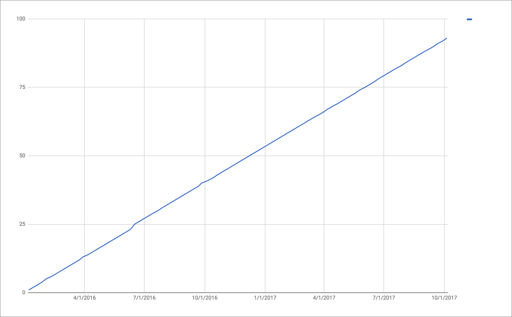

+++
title = "Meta"
date = "2017-10-05"
slug = "meta"
draft = false
+++

*[This post was inspired by a conversation I had with Natalia Goreva**. Thank you, nat-nat, for bringing this up.]*

I recently had a colleague ask me why I do igotw. I thought it might be interesting to dive into that as a sort of meta-subject. It's gotta start off with a graph of some kind so I'll go ahead and give this one:

This is not an inGraph - it's a thing I threw together in Excel - but it depicts the number of igotw posts over time. Frankly, it's a graph I'm proud of. I set out to do this as a Thing - every Thursday there Will Be a Post - and I've stuck to that for damn near 100 posts. (Mad love to _Isaac Finnegan for setting this in _ motion in the first place, otherwise it likely never would've existed.)

Taking a close look at that graph, there are a few deviations in slope. I did a special post when the MSFT acquisition announcement dropped. There were a couple of "mystery" posts that came out earlier in the week and were subsequently updated with the solution/explanation. ...and there were a couple of times where I mebbe had a shitty oncall (or just plain forgot) and the post came out on Friday morning instead of Thursday night. So be it. As a human being, I feel like it's as consistent as I could possibly make it.

Who gives a fuck? Well, I do. Maybe some other people do, too. That's about the best I think I can hope for.

Thank you for reading...and thank you to the folks who've contributed inGraphs, posts, comments, and encouragement along the way. (You know who you

are. )

