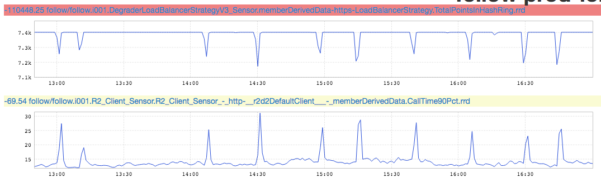

+++
title = "Reciprocal Graphs"
date = "2017-10-13"
slug = "reciprocal-graphs"
draft = false
+++

_The inGraphs for this week's post were submitted by Drew Dibble_ (Thanks, Drew! ) Let's take a peek:

These are just lovely. In Drew's own words: "This one looks like stalactites/stalagmites to me, and shows the relationship between downstream latency and the TotalPointsInHashRing metric." Let's unpack that a bit.

The bottom graph is fairly straightforward - it's showing latency in the 90th percentile. ...but what's going on with this "TotalPointsInHashRing" thing? Why does it go down when latencies go up?

Well, to understand that there's a bit of background required with respect to how rest.li clients attempt to degrade gracefully in the event that a particular [downstream host is misbehaving. I don't want to dive too deep into consistent hashing](https://en.wikipedia.org/wiki/Consistent_hashing) implementation here - if you have questions then please hit me up - but the long-and-short of it is that clients maintain a "score" for each individual downstream host. If all downstream hosts are behaving as expected then they all receive the same number of points and calls to those hosts end up being more or less evenly distributed.

...but suppose one host is **not** behaving as expected. Suppose it starts exhibiting higher latency, more errors, etc. Well, if that happens then the client will start to dock points...which is to say, the client will start to reduce the probability that any given call will go to the "broken" host in order to sort of "route around" the failure.

And that's how you end up with inGraphs like the above. Latency goes up, overall score goes down. Latency goes back to "normal", score stabilizes back to "normal".
