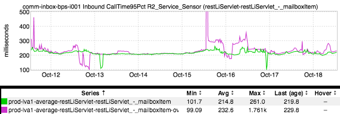
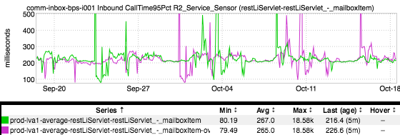
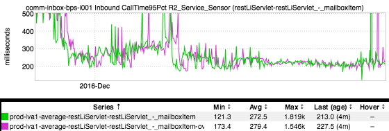

+++
title = "RRDs and Granularity"
date = "2017-10-19"
slug = "rrds-and-granularity"
draft = false
+++

*[The idea for today's post came out of a conversation I had with* *Unknown User (jgong). Thanks, Jian!* *]*

One of my engineers recently noticed something peculiar in inGraphs. He was looking at an inGraph of the error percentage for some endpoint. When he looked at data for one day ("today"), the graph spiked up to a maximum of 35%. ...but then when he backed it out to look at one week, the maximum was only 21%. I don't have the particular inGraph he was looking at handy, but this is easy to reproduce for the purposes of demonstration with pretty much any inGraph. Observe the following three inGraphs of the same metric on one-week, one-month, and one-year timescales, respectively:

Take a close look at the Max values. In the first one, the Max is 261.0. In the second, it's 18.58k. So far nothing surprising - something happened over the course of the past month that caused a spike in latency. But in the third graph, the Max value is...1.819k? How can the maximum value for the past year be *less* than the maximum value for the past month? Well, to understand that we'll need to talk a little bit about how inGraphs/autometrics actually store the data.

[Autometrics stores data points in something called a Round Robin Database](https://en.wikipedia.org/wiki/RRDtool)[ (RRD), which are manipulated by the appropriately-named RRDtool. An ](https://oss.oetiker.ch/rrdtool/tut/rrdtutorial.en.html) important feature of RRDs is that they have a fixed size, which is a nice property to have if you want to ensure that the amount of storage required for a given metric doesn't grow unbounded (or at all!) When you first create an RRD you specify one or more intervals, the number of data points to store for that interval, and a "consolidation function" - a function for "rolling up" the data at lower granularities. Thinking of it in terms of retention for each interval, you might say "Store data points at 1-minute intervals for 1 day, 1-hour intervals for 1 month, and 1-day intervals for 1 year. Use Average as your consolidation function." RRDtool would then create a collection of circular buffers in which to store data, overwriting the oldest data point with the newest one once those buffers are "full" and using the consolidation function ("Average") to interpolate the data where necessary.

[What do I mean by this last bit? Well, the RRDtool tutorial](https://oss.oetiker.ch/rrdtool/tut/rrdtutorial.en.html) uses a car example, so I'll do the same here. Suppose I drive 100mph for 30 minutes, and then I stop to grab lunch for 30 minutes. If you ask how fast I was going in, say, minute 7, the answer is 100mph. In minute 46? 0mph. ...but how fast was I going for the hour? Well, on average, 50mph.

Taking it back to explaining this phenomenon in inGraphs, what we're are looking at is not "the absolute maximum", it's actually "the maximum of the average" (so to speak).

**Update:** _Fellyn Silliman from monitoring-infra brought up a really good point - this happens "only mostly" due to the way in which RRD interpolates data. _ It's also important to note that inGraphs only has a finite number of pixels with which to work; i.e., inGraphs needs to downsample the data in order to be able to actually render it on your screen. The upshot of this downsampling: if you increase/decrease the size of your graph, the values being displayed can

actually change. (Thanks for calling that out, Fellyn. )
