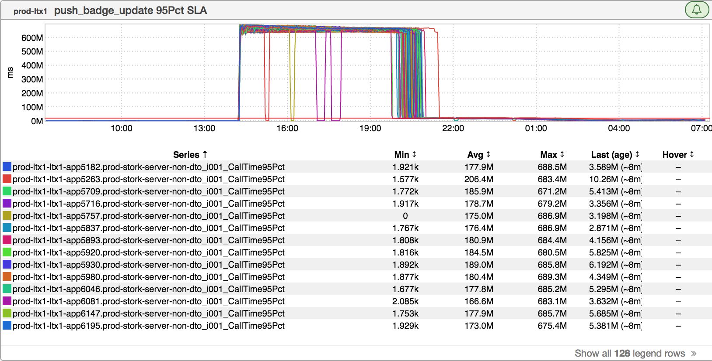
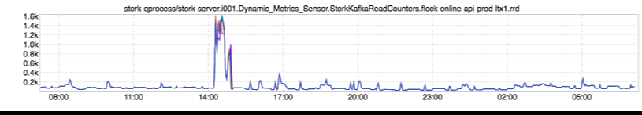
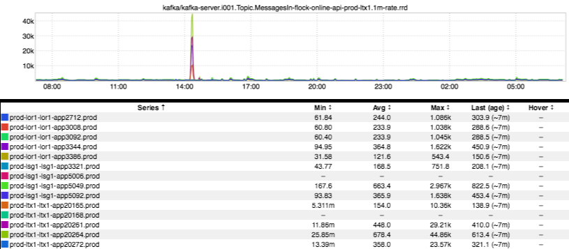
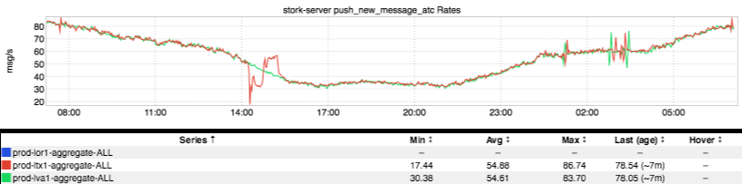

+++
title = "Duplicates"
date = "2017-10-27"
slug = "duplicates"
draft = false
+++

I thought it might be constructive to do a breakdown of a [recent GCN](https://jira01.corp.linkedin.com:8443/browse/GCN-24671) while it's still fresh in my mind. Let's jump into this with how it started - with _Shubhans_ _hu Nagar_ coming to me with an inGraph:

Huh. So all of a sudden the p95 delivery time of this particular push notification jumped to around 600M milliseconds (something on the order of 7 days). Well, that seems pretty bad - it's probably Not Okay to send out push notifications 7 days after the fact - so let's try and figure out what happened. After a bit of digging, we see some inGraphs that look like this:

Okay. So a big influx of kafka messages...but where did they come from? ATC is where these particular messages originate, but ATC isn't showing an uptick at all. ...and why are we only seeing them in a single production fabric (prod-ltx1)? Time to get someone from kafka-sre in the channel.

As it turns out, there was some mirror-maker maintenance that went a bit awry (see:

[**GCN-24648**](https://jira01.corp.linkedin.com:8443/browse/GCN-24648) - [LSG1] Kafka Mirror Maker aggregate-tracking cluster cannot keep up on the topic UserRequestEvent **COMPLETED**  ). Specifically, the

name of the kafka consumer group for mirror-maker was set incorrectly. Kafka offsets are tracked by consumer group, so mirror-maker started consuming messages from the beginning of the kafka topic as opposed to "picking up where it left off". The upshot: mirror-maker started mirroring messages that were upwards of 7 days old. Stork received these mirrored messages and started sending them out, in the form of week-old duplicate emails/push notifications /SMS. On a side note: this had some corrolary impact, including some message delay while stork figured out how to cope with a sudden pile of messages to send:

A question that was raised on perhaps a dozen occassions over the course of this incident: "Stork does deduplication, right?" Well...sort of. I can assure you: during this incident, duplicate emails/pushses/SMS were delivered. For that very reason, there is some nuance to how stork dedupe operates that is worth pointing out here. So, let's talk about how it works.

***[Disclaimer: This is my understanding of how stork's dedupe API works. Please do not take it as Fact, particularly if you are reading this in the*** ***future.]*** Stork exposes a deduplication API. The way it works: clients may choose to provide a deduplication key. Upon receiving a message to be sent - whether it be email, push, or SMS - stork will first inspect its deduplication cache (Couchbase) to see whether that key exists. If the key exists, stork will drop the message on the floor as a duplicate (and, of course, increment a duplicate counter metric). If the key does not exist, then stork will render and deliver the message.

A couple of things about the above:

1. The TTL on the deduplication cache is 7 days, for reasons that will be described below.

2. ***[Please re-read the disclaimer above]*** The default dedupe key if none has been provided is effectively a timestamp, for reasons that will hopefully become apparent below.

**On the TTL:** The stork dedupe cache was originally implemented as a failsafe mechanism for digest email campaigns. These campaigns were (typically) generated weekly by Hadoop jobs and caused a fair bit of duplicate email pain by virtue of their "dupiness". The weekly nature of these campaigns is where the 7-day TTL Came To Be.

**On the dedupe key:** This one is a little trickier. It's typically a hash of the emailkey (which is like a pagekey, but for email/push/sms), in addition to something like sender and/or recipient MID. It's non-trivial to come up with a global dedupe key that works for all outbound comms. Let me give you two examples in order to illustrate this.

Suppose you want a dedupe key for member-to-member invitations. A good pick might be a hash of sender MID, recipient MID, and emailkey - we don't want to see more than one connection request go out between two members in a given week (irrespective of any upstream limitations that might be in place).

...but now suppose you're talking about something like push notifications for messaging. Suppose you and I are having a conversation on mobile. Well, now sender/recipient MID and emailkey aren't quite sufficient. Now we need to also include some kind of unique identifier for individual messages.

This is just one example, there are (many) others. tl;dr: ***Deduplication logic is business logic***.

***Below the fold:***

Perhaps the most interesting aspect of this: for transactional emails like invitations - one of several emails that got duplicated during this incident - this kind of thing was never a problem in the past. Suppose you clicked on the "Invite Cliff" button. The invitations service would stuff something into a database and then call stork directly to generate an email - "Hey, Cliff, Duder wants to be your fran." ...fast-forward a few years and you've got ATC - a middleman - a system designed to make intelligent decisions about channel selection (should I send a push or an email?), batching/digesting (Cliff got 1000 invitations today, maybe we should just send him 1 email?), etc. So now these previously-synchronous comms are being delivered via asynchronous mechanisms (read: kafka) - and for good reason! This injects the possibility of re-consuming (and re-sending) messages, so perhaps it's time to revisit how we're handling deduplication for them.

