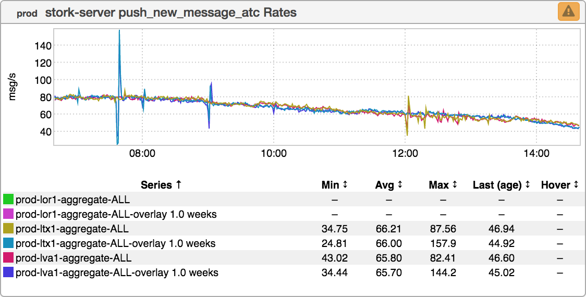
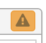
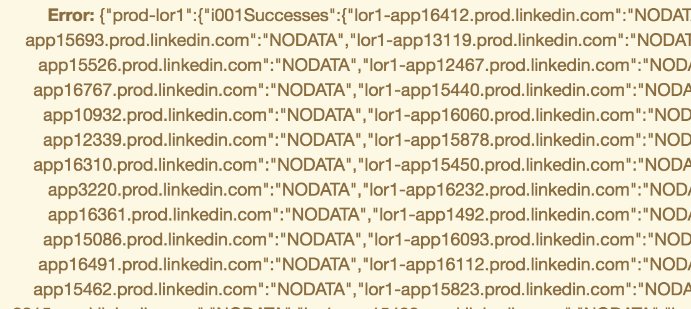

+++
title = "Mailbag"
date = "2017-11-02"
slug = "mailbag"
draft = false
+++

*[This week I thought I'd answer a few questions I got from* *Alexsandra McMahan (thanks, mickmayhay!) I like this idea of having some kind of a recurring*

*"Mailbag" segment for helping folks understand How Shit Works, so if you have a question then please hit me up!* *]*

First up:

**“wtf does it mean/wtf do I do when my ingraph has a little error thingy?”**

Well, let's see what "little error thingy" we're talking about here:

It's in the upper right-hand, it looks like this:

You can click on it and it'll give you something like this:

Yeesh. Okay, so, there are (roughly) one jillion reasons why you could be getting this "thingy". A (non-exhaustive) list of possibilities:

Some hosts were removed and the dashboard still references them A metric name changed and the dashboard still references it Some nodes stopped emitting the metric, for better or worse Better: Perhaps an endpoint was deprecated Worse: Perhaps an endpoint has been Proper Fucked for a few weeks and no one noticed A butterfly flapped its wings somewhere in Argentina during a thunderstorm and..

Well, I think you get the idea. Hopefully this at least gives you some idea of the "flavor" that these types of failures might take. I hate giving this kind of answer, but it's really hard to diagnose why a particular metric might not have any data for a particular host. The best I can say is this: Understand your data, and if it doesn't look right **and** inGraphs is giving you an error-thingy then dig into it a bit.

...and if it turns out that the dashboard is completely broken, then good news! The next question speaks to that:

**“is there a way to look up who made an ingraph dashboard?”**

Yep! There sure is (for now). inGraphs follows a super-familiar pattern at LinkedIn: check in your changes to source control, and those changes will get synced eventually (read: some time between ~30 minutes from now and the heat death of the universe). A really nice property of this pattern is that it provides a built-in mechanism for change audit. Just check out the repo where the dashboard definitions are stored:

svn+[ssh://svn.corp.linkedin.com/lirepo/itops/trunk/inGraphs](ssh://svn.corp.linkedin.com/lirepo/itops/trunk/inGraphs)

...and svn log it to your heart's content.

I mentioned "for now" above. This is changing. Another familiar LinkedIn pattern: migrating things out of source control and into Some Database/API Somewhere. In the Brave New World of dashboards being managed via a (probably-/mostly-RESTful) API I don't actually know how to figure out when changes were made, or by whom. Ah, well. Progress.

Moving on...

**“top 5 keyboard shortcuts to be an ingraph pro”**

Not exactly in question form, but a few keyboard shortcuts I commonly use:

**<num>** - Press a number and inGraphs will fit that number of columns to your browser's screen real estate.  (Fun Fact: most often-used: 2). **m** - "Multifabric Consolidate" **l** - "Toggle legend" **p** - "Presentation Mode". Remove all inGraphs "chrome".

lol Okay, so that's only 4, but hopefully these keyboard shortcuts help you to navigate inGraphs more efficiently.
