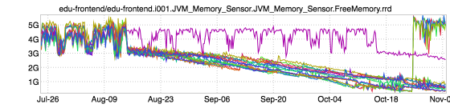
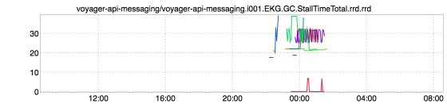
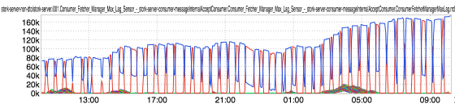
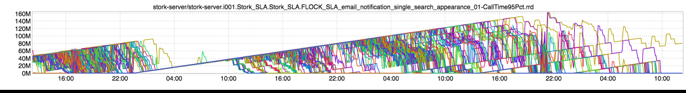

+++
title = "Unintentional Art"
date = "2017-11-09"
slug = "unintentional-art"
draft = false
+++

The first bit of UA comes from _Nick Brown (thanks, Nick!) and is a pretty good demonstration of what a slow memory leak might look like in the absence of _ occasional restarts:

Next up is an interesting scribble of abstract art that I'm thinking of entitling "Laser Caterpillar" (or something):

The li'l guy below is a demonstration of some interesting kafka consumer lag behavior. I'm pretty sure it's a pair of nodes continually trading consumption of the same kafka partition (or set of partitions). This saga plays out almost like a childrens' story. It "belongs" to the blue one, but every time Blue gets restarted the partition gets re-assigned to Red (and then back to Blue after it comes back up). In their fight for dominance neither of them ever quite drains the queue. I don't know what the moral is, but it's immeasurably sad if you think about it for too long. Ah, well...life's tough, and I'm sure they're both trying their best to get by.

Finally, what delivery time looks like if you dump 10s of millions of messages on a system that has intentionally been rate-limited to only process at a rate of 0.5 QPS (one message every two seconds) per node:

