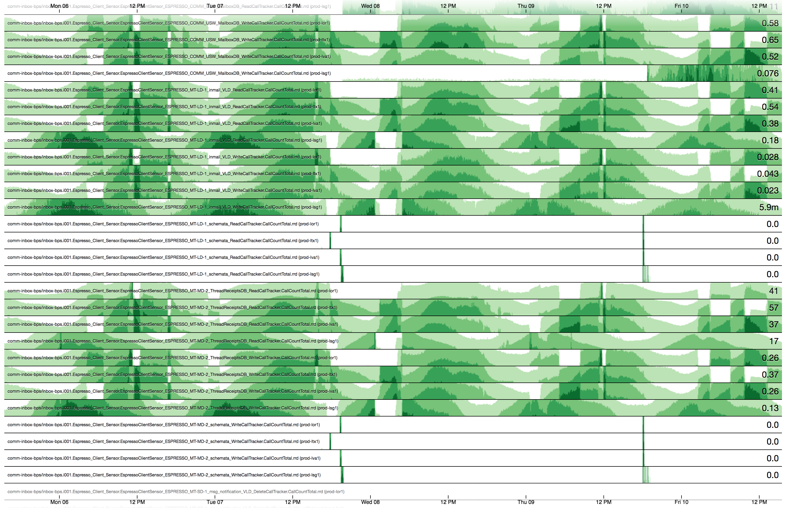

+++
title = "Cubism"
date = "2017-11-16"
slug = "cubism"
draft = false
+++

[I've spent a little time playing around with visualization tools like cubism.js](https://square.github.io/cubism/). I love me some inGraphs (see: like every post here ever), but I'm interested in whether there might be some more interesting/meaningful/helpful ways to look at The Data. As a side project - something to hack around on inDays - it's interesting to me. Take a look at this:

This is another way of looking at downstream calls for a particular service (comm-inbox-bps). There's a whole lot going on here, but information density is kind of the point. There are a bunch of things that can be picked out:

1. It's 5 days' worth of data, so daily peaks are visible.

2. Individuals fabrics are laid out in sequence, so traffic shifts pop out (white bands in one fabric, darkening bands in the others)

3. Calls to Espresso "schemata" occasionally, likely aligned to deployment/restart activity and likely meaning that comm-inbox-bps is leveraging client-side Espresso schema upconvert on deploy/restart (which actually scares me a bit, based on issues I've seen that "feature" cause)

Just a whole pile of interesting data, looked at in a different way (and all leveraging the same data source - autometrics - that inGraphs does).

