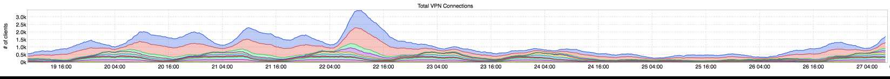
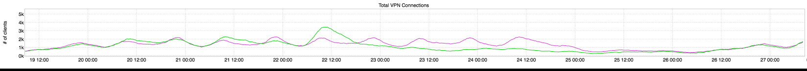

+++
title = "WFH"
date = "2017-12-01"
slug = "wfh"
draft = false
+++

_I know I already did a Thanksgiving post__, but Michael Kehoe pointed out an inGraph that was just too good to pass up (thanks, Michael!):_

Thi s is an inGraph of total connections to the VPN. Notice that big bump in the middle there? That would be the Wednesday before Thanksgiving. Taking a consolidated look comparing to WoW:

Perhaps unsurprisingly, it would appear that working from home is a fairly popular trend on that particular day.
