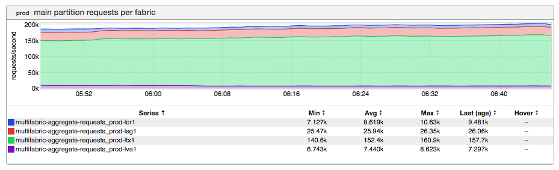
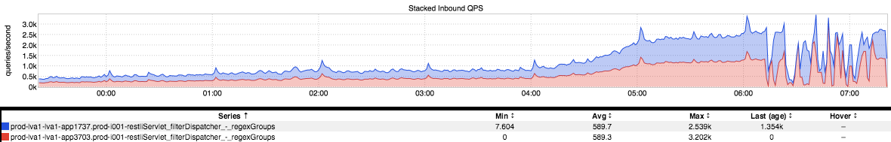
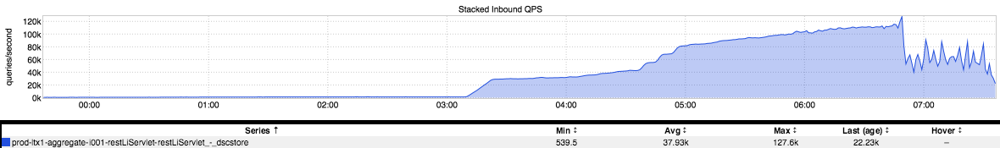
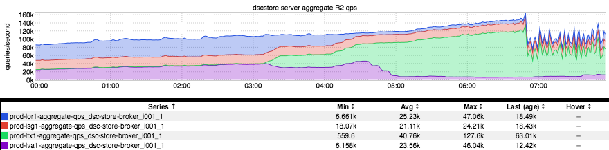
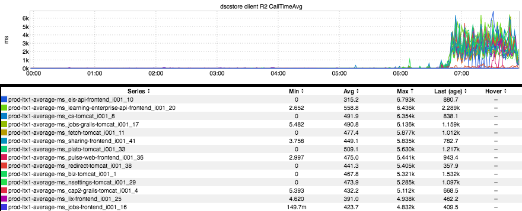
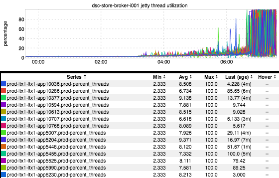
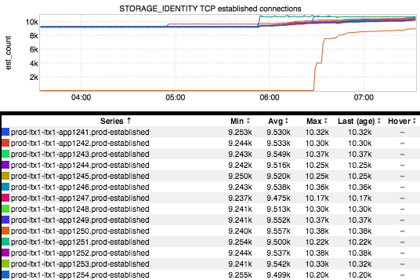
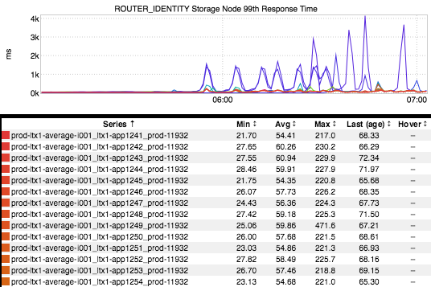

+++
title = "Load Testing"
date = "2017-12-07"
slug = "load-testing"
draft = false
+++

Most folks reading this are probably aware of the recent load testing war-room effort...and if you're not aware of it then you've either been on extended DTO or haven't been paying attention. At any rate, the idea is the following: given traffic projections going into 2018 we need to be able to support X traffic (for a particular value of X - seriously, read your email) and we aren't quite able to do that just yet. This effort has led to a whole pile of capacity uplifts, performance tuning, config changes, etc. ...and, naturally, a concomitant pile of interesting inGraphs.

Let's take a peek at some of these inGraphs. Perhaps worth noting: I literally picked the last 8-9 inGraphs I've saved off and pasted them into this post.

First: What load testing looks like wrt traffic being directed into a particular fabric (in this case, prod-ltx1):

Next up: A few examples of what it looks like when a service is doing Just Fine and then shits all over itself, succumbing to the pressure of the additional load:

There are a multitude of reasons why a service might see this kind of QPS dropoff. Maybe it's a substantial increase in latency:

...or blowing out a thread pool:

...or blowing out a downstream connection limit (read: Espresso):

...or blowing out an **upstream** connection limit (read: L1):

...or maybe there are one or two Bad Actors that decide to go apeshit at the worst possible time:

I suppose the tl;dr of this It's a complex problem space, with many moving parts.

A huge Thank You to everyone who has contributed to helping us understand how we're going to support the anticipated load moving forward.

