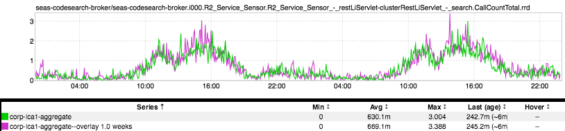

+++
title = "Calories"
date = "2017-12-14"
slug = "calories"
draft = false
+++

[In one of my favorite talks of all time ](https://www.ted.com/talks/robert_sapolsky_the_uniqueness_of_humans)[Dr. Robert Sapolsky](https://en.wikipedia.org/wiki/Robert_Sapolsky),  talks about the things that make humans unique (and not-so-unique) in the animal kingdom. One of the things he brings up toward the beginning of the talk is the enormous amount of calories that individual human beings can expend just thinking; specifically, the amount of calories expended by chess grand masters. The numbers he gives - something on the order of 6,000-7,000 calories a day - are hard for me to believe...but he's a well-respected neurobiologist who has spent his career studying stress responses, so I reckon I'll take his word for it.

Now you're probably asking "What the fuck does this have to do with inGraphs?" Well, I'm getting there. _Juan Grande pointed out this fun little inGraph to _ me the other day (thanks, Juan!) and it make me think of Dr. Sapolsky:

[This is a couple of days' worth of QPS to code search. If you play around with the timeline the regular patterns apply - down on nights & weekends, up ](https://jarvis.corp.linkedin.com/codesearch/) during business hours, etc. What Juan wanted to point out: take a look at the noon hour, aka Lunch Time. I know this is only 2 days (plus WoW overlay), but the lunch hour shows a consistent dip.

The tl;dr: thought-work takes calories, and thus Engineers need to eat.
