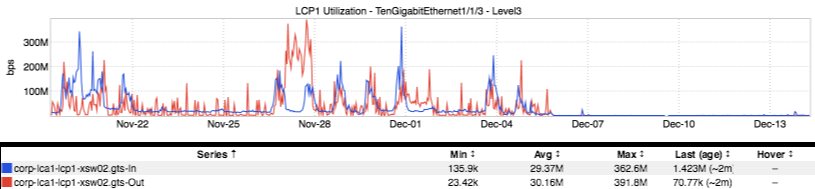
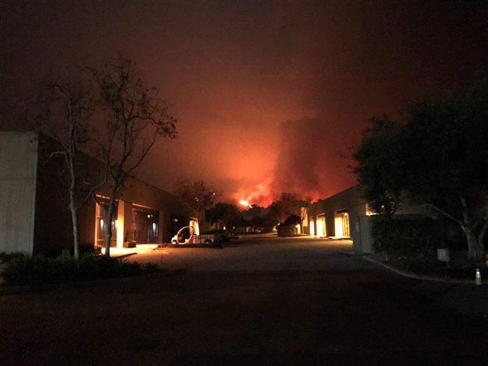

+++
title = "Carpinteria"
date = "2017-12-21"
slug = "carpinteria"
draft = false
+++

Folks are probably already aware of the [Southern California wildfires. What folks may ](http://www.cnn.com/2017/12/11/us/california-wildfires/index.html)**not** be aware of: there is a LinkedIn facility in Carpinteria that had to be [shut down and evacuated due to the approaching Thomas Fire (TIL: wildfires are named). ](https://jira01.corp.linkedin.com:8443/browse/GCN-25050)_"The campus was officially closed by Dec. 6, 2017 at 9 am." _ What does that look like? Well, there aren't a whole lot of inGraphs for LCP1, but I was able to dig up this inbound/outbound network graph:

More importantly, there are LinkedIn employees who have had to be evacuated. To the best of my knowledge no one has been injured, but some folks did lose their homes (GoFundMe links below). Please, folks, take a minute to click and donate.

[https://www.gofundme.com/helplucasventurafire](https://www.gofundme.com/helplucasventurafire)

[https://www.gofundme.com/fionaventurafire](https://www.gofundme.com/fionaventurafire)

[https://www.gofundme.com/4taikpk](https://www.gofundme.com/4taikpk)

**Update:** _Almost no sooner than I had clicked "Publish", Nate Jester_ pointed out that it's "Carpinteria" (not Carpenteria). He also sent the below photograph, taken from that campus recently:

_Scary shit. Thank you Nate for pointing out my typo, and thanks to John Soldo_ for the photo.
