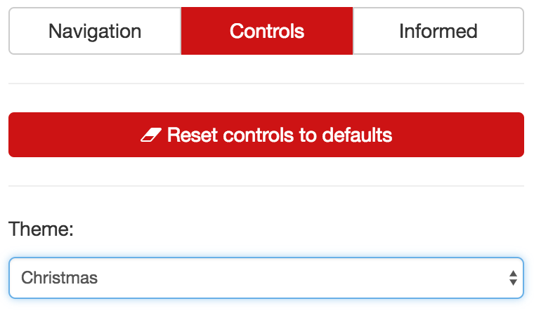
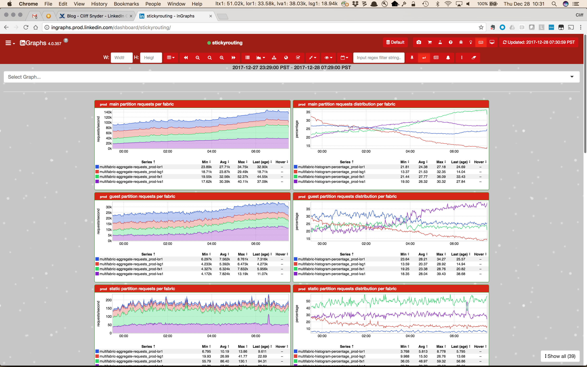

+++
title = "Christmas Theme"
date = "2017-12-28"
slug = "christmas-theme"
draft = false
+++

It may be a bit late for this, but for those of you who want to extend the Christmas Spirit a few days after the fact in your inGraphs this might prove useful. Take a look in the inGraphs UI for the Theme dropdown; it looks like this:

Set it to "Christmas" as in the screenshot above and *voila*!

It's not obvious from the screenshot, but those little white dots are animated to give the appearance of falling snow.

Enjoy!
