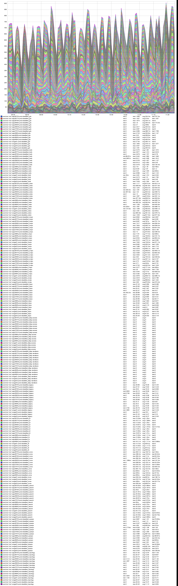
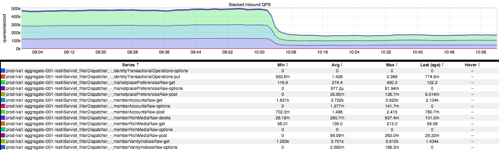
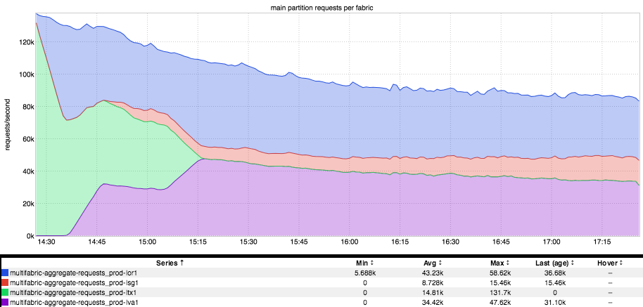

+++
title = "Unintentional Art"
date = "2018-01-12"
slug = "unintentional-art"
draft = false
+++

It's time to take a peek at a few more bits of unintentional inGraphs art, folks. First up, a little danger:

This piece makes me feel a touch uneasy. It's just this immense slab of an impossibly-spikey thing, precarious atop crumbling pillars. (Is this the first bit of UA in which the legend is actually a part of the artwork? I think it may be...)

Next up, a hummingbird:

Not convinced it looks like a hummingbird? Well, how about this one then?

Seriously, I could probably do an entire post on bird-like inGraphs...so let's go ahead and round it out with this lil guy:

When I look at this inGraph, I get the feel of an album - or maybe a song - that gets more and more energetic toward its end. The energy level starts out low (as does the volume) but it starts to pick up over time, gaining momentum (and volume) along the way until it's blaringly loud and your wife is telling you to "turn it down" because it's "too loud" and your "daughter" is trying to "sleep" or whatever. Danse Macabre is like that - a buildup to this sort of orchestral maelstrom at the end. So's Freebird; man, that solo just goes on forever...so rad. Yeah, Freebird. That's what this inGraph is to me. :-)
