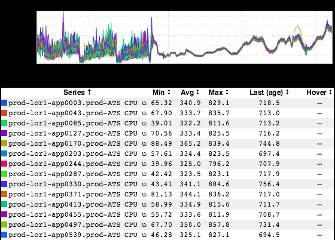

+++
title = "Unintended Consequences"
date = "2018-01-18"
slug = "unintended-consequences"
draft = false
+++

This week's post - courtesy of _Jon Sorenson_ (username pronounced "jay-so-n-so") - reminds me of a couple of [previous](/igotw/2016-11-10-load-un-balancing/) igotw _posts. When Jon first sent _ this my way, my first thought was "some kind of load balancing algorithm somewhere was busted and has since been un-busted". As it turns out, that's not actually the case. Let's take a peek:

Now, I don't pretend to understand the specifics of how this played out, but in Jon's own words:

"Authfilter imported a couchbase library. their code was "lixed off." Apparently by importing the library it decided that it would spawn and run 200 threads, and execute some code every time they ran."

[So it goes](https://en.wikipedia.org/wiki/Slaughterhouse-Five)_. So far as I'm concerned, this is one of the best examples of The Tighten-Up_ that I could've possibly ever found. Thanks for passing it along, _Jon _

_Sorenson_!
