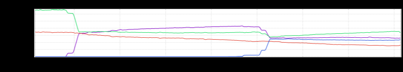
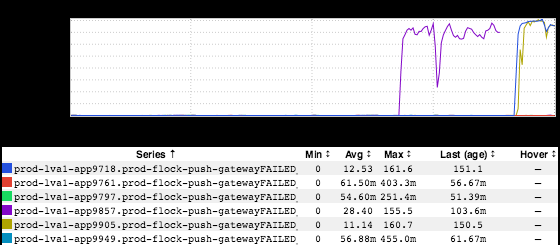
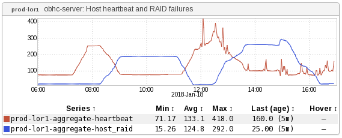

+++
title = "Cause & Effect"
date = "2018-01-25"
slug = "cause-effect"
draft = false
+++

An inGraph that _Matt Knecht_ sent my way last week made me think about the graphs I've seen that demonstrate cause & effect. A pretty common and accessible example of this is stickyrouting traffic distribution graphs during traffic shifts:

When the percentage of traffic goes up in one place, it goes down in another. Straightforward enough. Another one that I love:

[One node starts freaking out and throwing errors, so you try The IT Crowd Fix](https://en.wikipedia.org/wiki/Power_cycling)...and 2 **other** nodes start freaking out and throwing errors. Because computers are awesome like that.

...and the one Matt sent me? Well, check this out:

In Matt's own words (edited for spelling/punctuation):

[This is] obhc-server's aggregated view of two checks in prod-lor1. The red line here is obhc-server's idea of remote hosts that have lost heartbeat. This could mean obhc-agent has gone away, there's some kind of network cut, but most likely it means the host has just been powered off or not in a runstate that allows for obhc-agent to run.

The blue line is obhc-server's view of remote hosts that have a "failing" RAID array check.

I like how we can see hosts go offline as the red line increases, then as the red line decreases the blue increases showing hosts that have come back online and having to rebuild their arrays.

Marvelous. Thanks for passing this one along, Matt!
