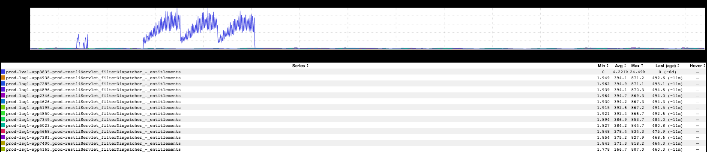
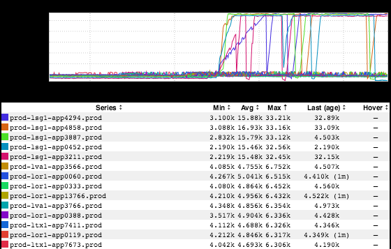
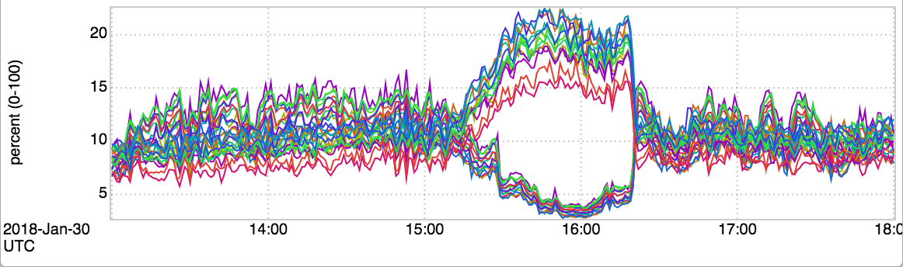

+++
title = "Unintentional Art"
date = "2018-02-02"
slug = "unintentional-art"
draft = false
+++

I know, I know - I just did a UA post _a few weeks ago. Maybe I'm like Bill Murray, _[doomed to repeat](http://www.imdb.com/title/tt0107048/) the same post over and over until I get it right.

This first inGraph makes me think of some kind of peasant uprising or something:

Thrice they tried to breach the castle walls...and thrice they were repelled. So sad. Next up: a classic example of _the plateau pattern (which seems to find _ its way into igotw **almost** as often as I see it "in the wild"):

With this one I'm actually a bit curious: how many SREs who have been at LinkedIn for longer than, say, 6 months have **not** seen some service somewhere blow through its file descriptor limit? I'd bet that number trends pretty hard to zero over time.

_...and finally, a wicked piece of UA that Karrick McDermott sent my way recently:_

Rawr. Karrick's take: [ouroboros. I can't decide if it reminds me more of a dragon or a ](https://en.wikipedia.org/wiki/Ouroboros)[snapping turtle](http://rivista-cdn.reptilesmagazine.com/snapper2.jpg?ver=1441145036). Either way, thanks for sending it along, Karrick!

