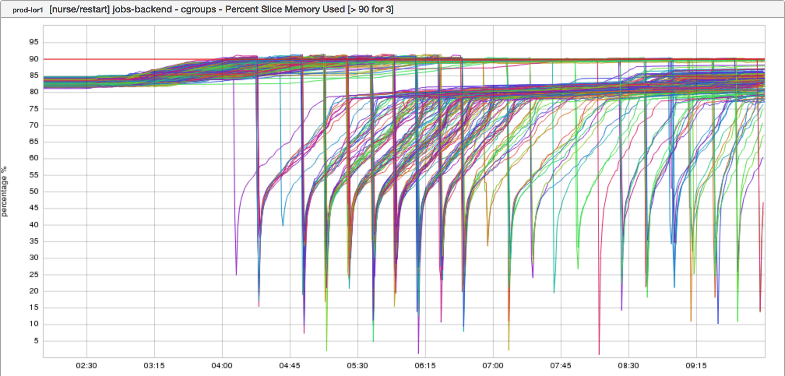

+++
title = "A Thousand Words"
date = "2018-02-08"
slug = "a-thousand-words"
draft = false
+++

_This week's igotw is centered around an inGraph provided by Ian Liu-Johnston_ (thanks, Ian!)

What I love about this inGraph (other than the fact that it looks fucking awesome): it tells a story. It's super-busy and there are probably too many colors, but it demonstrates a specific thing happening. I have a bit of insider knowledge about what that thing is, but if you gaze upon it for a while things start to pop out. Let's take a look at some of the (meta)data the graph provides:

The unit - the vertical scale - is expressed as a percentage There is a thin red line at "90", which in inGraphs denotes an alerting threshold The graph title is a bit opaque, but indicates that the inGraph has to do with "Memory Used" Also opaque, but I assume the "[>90 for 3]" describes the alerting criteria - i.e., "if at least 3 nodes go over 90% memory used then fire an alert"

I may have the details a bit wrong, but this looks to be an inGraph that drives an alert on memory use. Okay, so what started crack-a-lackin' around 04:00? At an almost freakishly-regular cadence The Numbers started dropping close to zero and then leveling off around 75-85 (as opposed to their previous values approaching/exceeding 90). What's up with that?

Well, this is what an uplift looks like - specifically, an uplift of a given slice's memory allocation. The regular cadence of drops/rebounds are instances being re-deployed with more memory (and thus a lower % of memory used).

So what does it look like once it levels off after all this noise?

Noice.

*[Thanks for the inGraphs* *Ian Liu-Johnston* *- let me know if I got it wrong!* *]*
