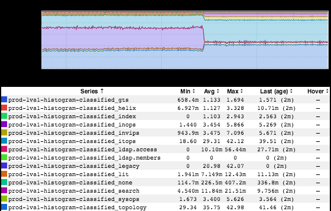

+++
title = "Love/Hate Relationship"
date = "2018-02-16"
slug = "love-hate-relationship"
draft = false
+++

I've spent a little time thinking about this inGraph that _Loren Carvalho shot my way (thanks, lo-lho!)_

Link: [http://ingraphs.prod.linkedin.com/dashboard/range-server/graph/classified?fabrics=prod-](http://ingraphs.prod.linkedin.com/dashboard/range-server/graph/classified?fabrics=prod-lva1&use_time_selector&start_time=1518573600000&end_time=1518832800000) [lva1&use_time_selector&start_time=1518573600000&end_time=1518832800000 (Seriously, guys, why the fuck haven't I been linking to these all along? ](http://ingraphs.prod.linkedin.com/dashboard/range-server/graph/classified?fabrics=prod-lva1&use_time_selector&start_time=1518573600000&end_time=1518832800000) Click it. Play around with it a bit.)

Anyhow...there are things I love about this inGraph and things I hate about it.

What do I love? For one: it's named ***classified***. Whoa. I'm not sure whether I have sufficient security clearance to even be looking at this inGraph. *I could* *tell you what this is, but then I'd have to kill you.* I also love that it represents legacy range being turned off; sweeping tech debt off the front porch is always awesome. It also has a certain aesthetic...which is to say: it looks super-rad.

What don't I love? Well...it's named ***classified***. Not super-descriptive. *I could tell you what this means, but then I'd have to kill you.* Also, stacked graphs like this can be really difficult to interpret. There was a Big Purple that kinda smooshed down and had its area replaced by some additional Big Blue, and then some of the New Yellow and New (but Slightly-Different) Purple...aww, fuck it, who knows what's going on. (This is why I linked to it - a lot of this is mitigated by being able to hover over the graph and see the values as you slide back and forth).

At any rate it's a great inGraph. Thanks for passing it along, lo-lho, and kudos to you and all the folks involved in shutting down legacy range!
