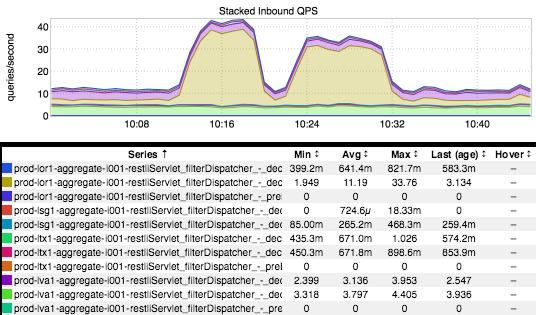

+++
title = "Backlog"
date = "2018-02-22"
slug = "backlog"
draft = false
+++

_Matt Knecht__ got me kind of thinking with his comment on last week's post - what exactly _**do** I have lying around in my igotw "stash"? Welp, a rough count:

$ find graphs  | wc -l

874

Huh, okay. Well...what are they named? Most of them take the following form:

voyager-api-frontend_voyager-api-frontend_i002_HTTP_Input_Sensor_HTTP_Input_Sensor_- _filter_segmentedInboundSensor_Overall_CallCountTotal_rrd.png

That should be pretty recognizable to folks who've use inGraphs - name-mangled metric strings tend to look something like that. There's a ton of detail that can be gleaned from a name like that - what the service was, the instance, the name of the sensor, etc.

...but a handful of the graphs I have saved are decidedly more colorful (and less information-rich). Some examples:

spain-futbol.png zeppelin-vip-busted.png error-cake.png weethingswerebroken.png your-monitoring-is-bad.jpg

You get the idea.

Anyhow, I can't leave this post without at least one inGraph...so let's go ahead and take a look at one named "Stacked Inbound QPS copy 15.png" (one of 30+ with a similar name):

What is it? lol I have no idea. The traffic (QPS) went up, then went down again, then up again, then down again (over the course of ~20 minutes).

What service was it? Why did the inbound traffic look like it did? ...those details are lost to history.

Ah, well.
